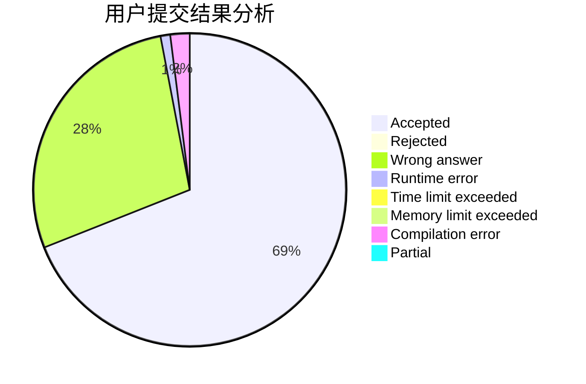
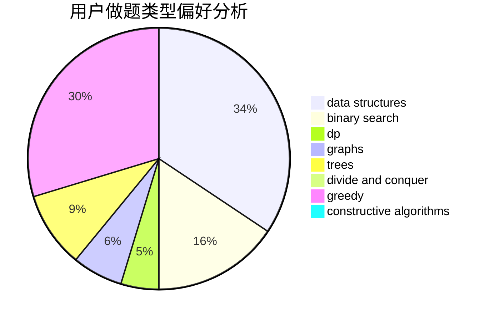
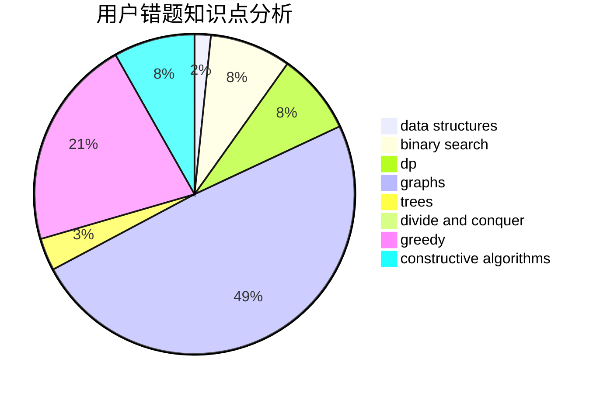

# dblark

<!-- tabs:start -->

#### **用户提交结果分析**

#### **用户做题类型偏好分析**

#### **用户错题知识点分析**

<!-- tabs:end -->
# 推荐题目
[1036B](https://codeforces.com/contest/1036/problem/B)		math		  
[1186D](https://codeforces.com/contest/1186/problem/D)		constructive algorithms,
                        greedy,
                        math		  
[652F](https://codeforces.com/contest/652/problem/F)		constructive algorithms,
                        math		  
[604C](https://codeforces.com/contest/604/problem/C)		dsu,graphs,sortings,trees		  
[306C](https://codeforces.com/contest/306/problem/C)		combinatorics,
                        number theory		  
[293A](https://codeforces.com/contest/293/problem/A)		games,
                        greedy		  
[116C](https://codeforces.com/contest/116/problem/C)		dsu,graphs,sortings,trees		  
[500B](https://codeforces.com/contest/500/problem/B)		dfs and similar,
                        dsu,
                        graphs,
                        greedy,
                        math,
                        sortings		  
[1118E](https://codeforces.com/contest/1118/problem/E)		constructive algorithms,
                        implementation		  
[604A](https://codeforces.com/contest/604/problem/A)		implementation		  
