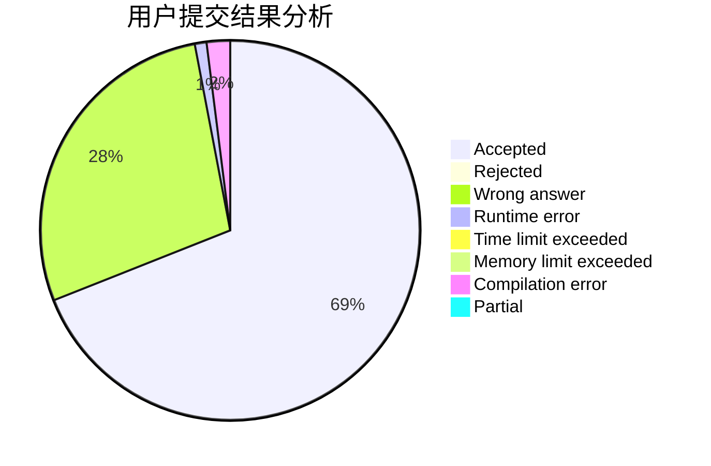
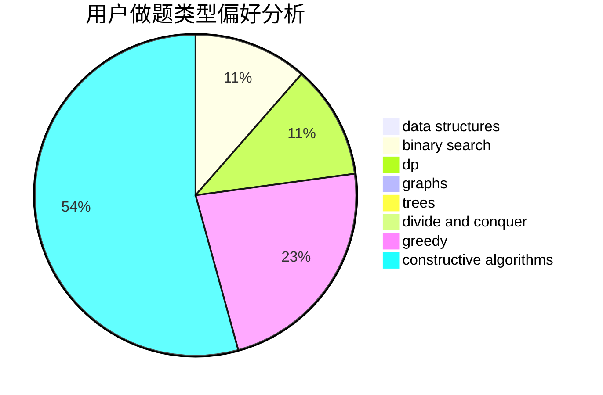
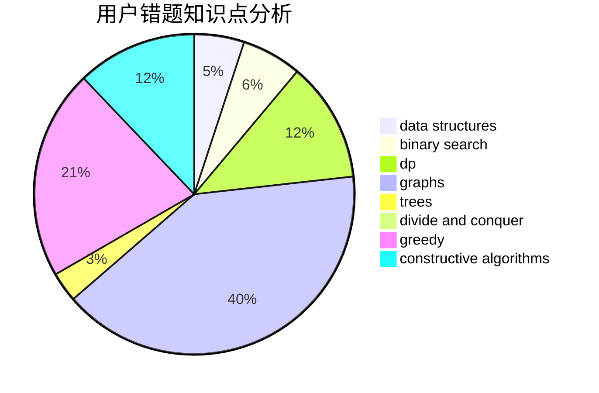

# dblark

<!-- tabs:start -->

#### **用户提交结果分析**

#### **用户做题类型偏好分析**

#### **用户错题知识点分析**

<!-- tabs:end -->
# 推荐题目
[1034D](https://codeforces.com/contest/1034/problem/D)		binary search,
                        data structures,
                        two pointers		  
[1183F](https://codeforces.com/contest/1183/problem/F)		brute force,
                        math,
                        sortings		  
[626E](https://codeforces.com/contest/626/problem/E)		binary search,
                        math,
                        ternary search		  
[584C](https://codeforces.com/contest/584/problem/C)		constructive algorithms,
                        greedy,
                        strings		  
[291E](https://codeforces.com/contest/291/problem/E)		*special problem,
                        dfs and similar,
                        hashing,
                        strings		  
[277E](https://codeforces.com/contest/277/problem/E)		flows,
                        trees		  
[1166F](https://codeforces.com/contest/1166/problem/F)		data structures,
                        dsu,
                        graphs,
                        hashing		  
[480B](https://codeforces.com/contest/480/problem/B)		dsu,graphs,sortings,trees		  
[1117A](https://codeforces.com/contest/1117/problem/A)		implementation,
                        math		  
[582E](https://codeforces.com/contest/582/problem/E)		bitmasks,
                        dp,
                        expression parsing		  
