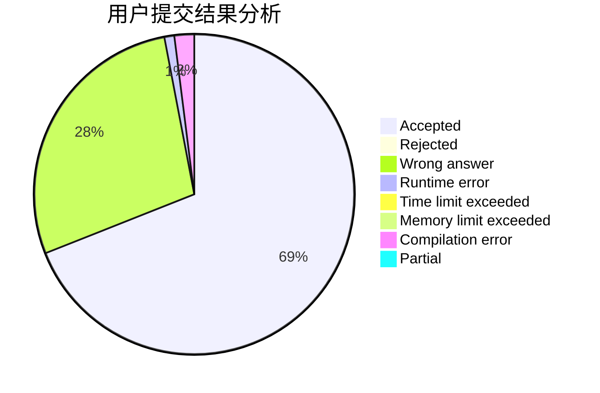
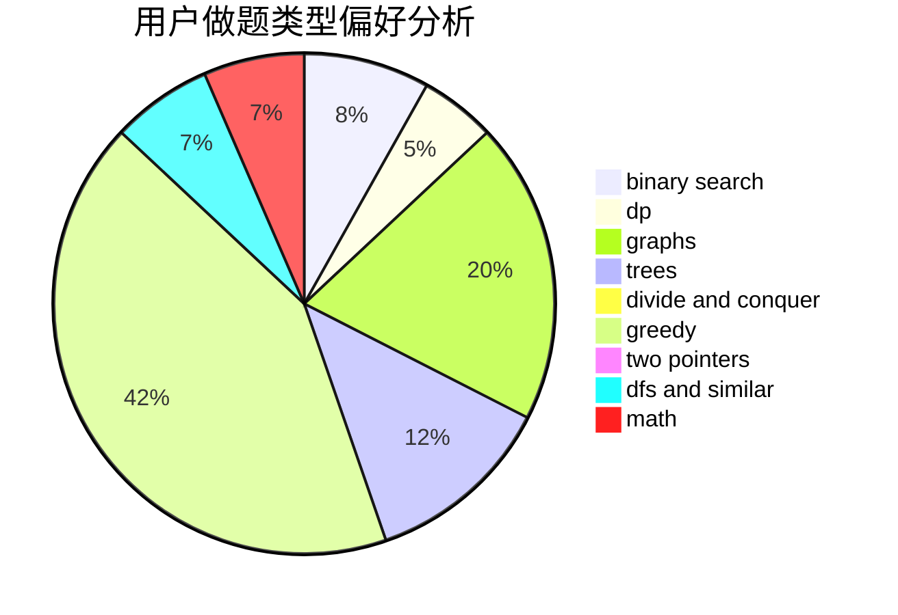

# dblark

<!-- tabs:start -->

#### **用户提交结果分析**

#### **用户做题类型偏好分析**

<!-- tabs:end -->
# 推荐题目
[1036B](https://codeforces.com/contest/1036/problem/B)
[1186D](https://codeforces.com/contest/1186/problem/D)
[652F](https://codeforces.com/contest/652/problem/F)
[604C](https://codeforces.com/contest/604/problem/C)
[306C](https://codeforces.com/contest/306/problem/C)
[293A](https://codeforces.com/contest/293/problem/A)
[116C](https://codeforces.com/contest/116/problem/C)
[500B](https://codeforces.com/contest/500/problem/B)
[1118E](https://codeforces.com/contest/1118/problem/E)
[604A](https://codeforces.com/contest/604/problem/A)
