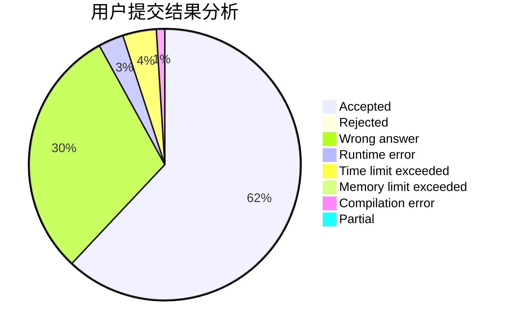
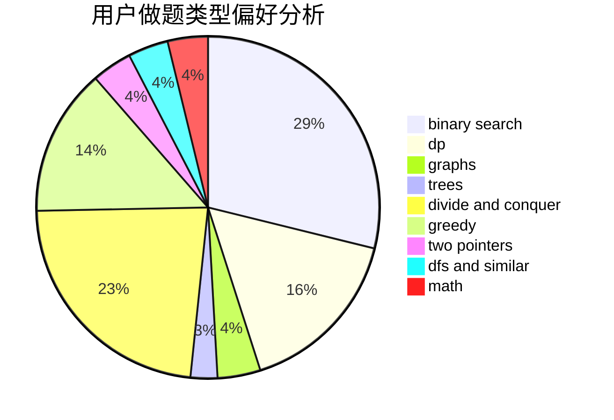

# dbldbqc

<!-- tabs:start -->

#### **用户提交结果分析**

#### **用户做题类型偏好分析**

<!-- tabs:end -->
# 推荐题目
[722D](https://codeforces.com/contest/722/problem/D)
[1250I](https://codeforces.com/contest/1250/problem/I)
[1782](https://codeforces.com/contest/178/problem/2)
[1385G](https://codeforces.com/contest/1385/problem/G)
[69E](https://codeforces.com/contest/69/problem/E)
[804C](https://codeforces.com/contest/804/problem/C)
[1117G](https://codeforces.com/contest/1117/problem/G)
[997E](https://codeforces.com/contest/997/problem/E)
[266C](https://codeforces.com/contest/266/problem/C)
[13762](https://codeforces.com/contest/1376/problem/2)
