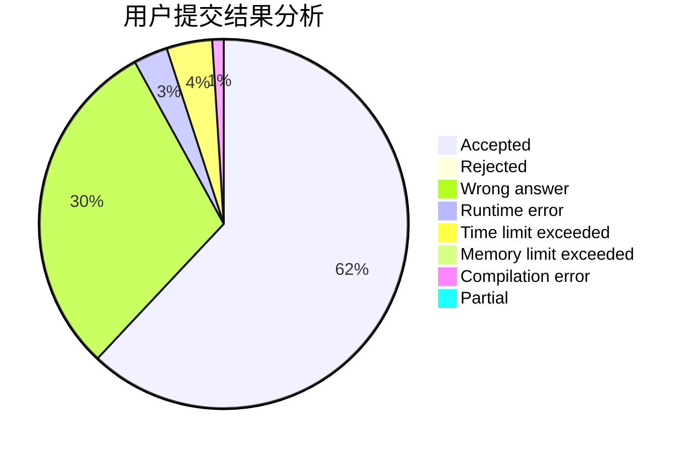
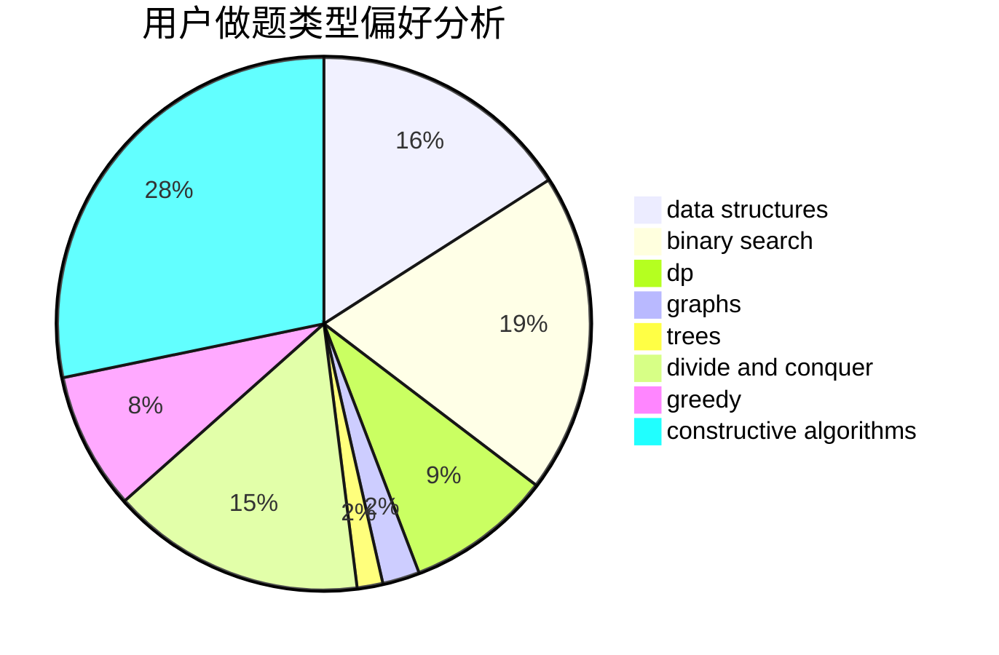
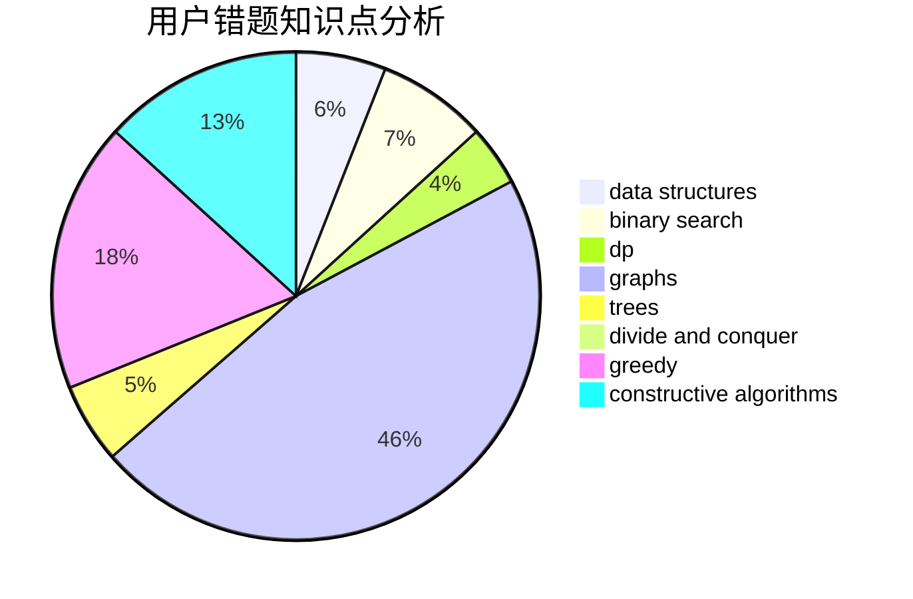

# dbldbqc

<!-- tabs:start -->

#### **用户提交结果分析**

#### **用户做题类型偏好分析**

#### **用户错题知识点分析**

<!-- tabs:end -->
# 推荐题目
[722D](https://codeforces.com/contest/722/problem/D)		binary search,
                        data structures,
                        dfs and similar,
                        greedy,
                        strings,
                        trees		  
[1250I](https://codeforces.com/contest/1250/problem/I)		binary search,
                        brute force,
                        greedy,
                        shortest paths		  
[1782](https://codeforces.com/contest/178/problem/2)		dsu,graphs,sortings,trees		  
[1385G](https://codeforces.com/contest/1385/problem/G)		2-sat,
                        dfs and similar,
                        dsu,
                        graphs,
                        implementation		  
[69E](https://codeforces.com/contest/69/problem/E)		data structures,
                        implementation		  
[804C](https://codeforces.com/contest/804/problem/C)		constructive algorithms,
                        dfs and similar,
                        greedy		  
[1117G](https://codeforces.com/contest/1117/problem/G)		data structures		  
[997E](https://codeforces.com/contest/997/problem/E)		data structures		  
[266C](https://codeforces.com/contest/266/problem/C)		constructive algorithms,
                        greedy,
                        math		  
[13762](https://codeforces.com/contest/1376/problem/2)		dsu,graphs,sortings,trees		  
