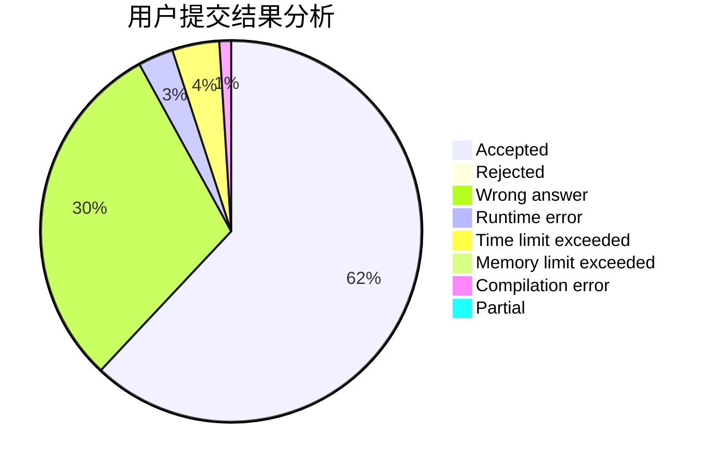
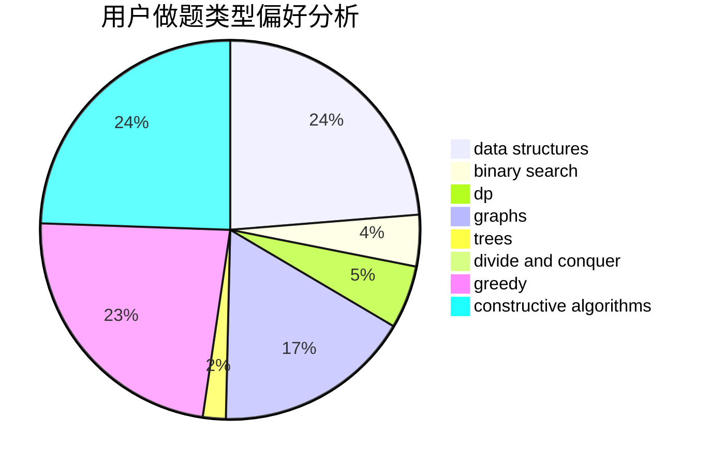
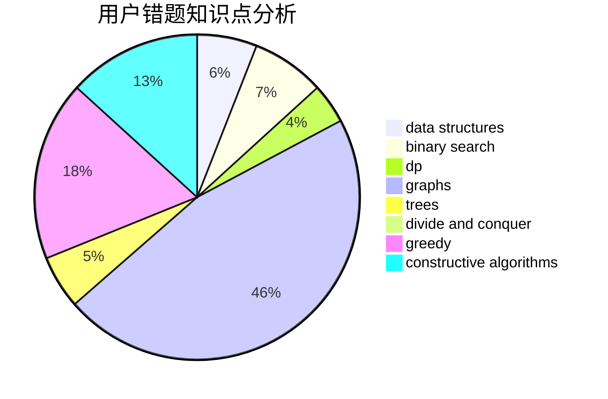

# dbldbqc

<!-- tabs:start -->

#### **用户提交结果分析**

#### **用户做题类型偏好分析**

#### **用户错题知识点分析**

<!-- tabs:end -->
# 推荐题目
[703C](https://codeforces.com/contest/703/problem/C)		geometry,
                        implementation		  
[1246A](https://codeforces.com/contest/1246/problem/A)		dsu,graphs,sortings,trees		  
[157C](https://codeforces.com/contest/157/problem/C)		dsu,graphs,sortings,trees		  
[1376B3](https://codeforces.com/contest/1376B/problem/3)		dsu,graphs,sortings,trees		  
[675B](https://codeforces.com/contest/675/problem/B)		brute force,
                        constructive algorithms,
                        math		  
[789A](https://codeforces.com/contest/789/problem/A)		implementation,
                        math		  
[1116C1](https://codeforces.com/contest/1116C/problem/1)		nan		  
[982B](https://codeforces.com/contest/982/problem/B)		data structures,
                        greedy,
                        implementation		  
[246A](https://codeforces.com/contest/246/problem/A)		constructive algorithms,
                        greedy,
                        sortings		  
[1369C](https://codeforces.com/contest/1369/problem/C)		greedy,
                        math,
                        sortings,
                        two pointers		  
