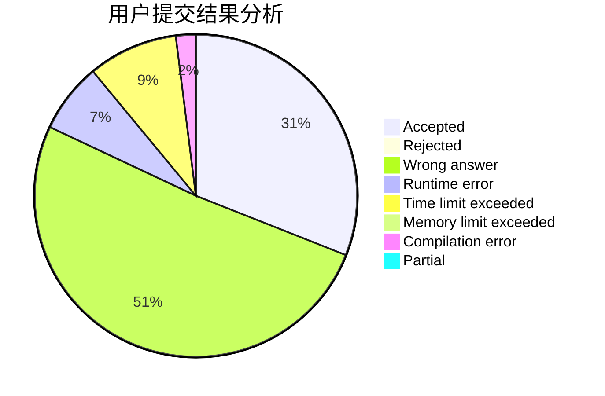
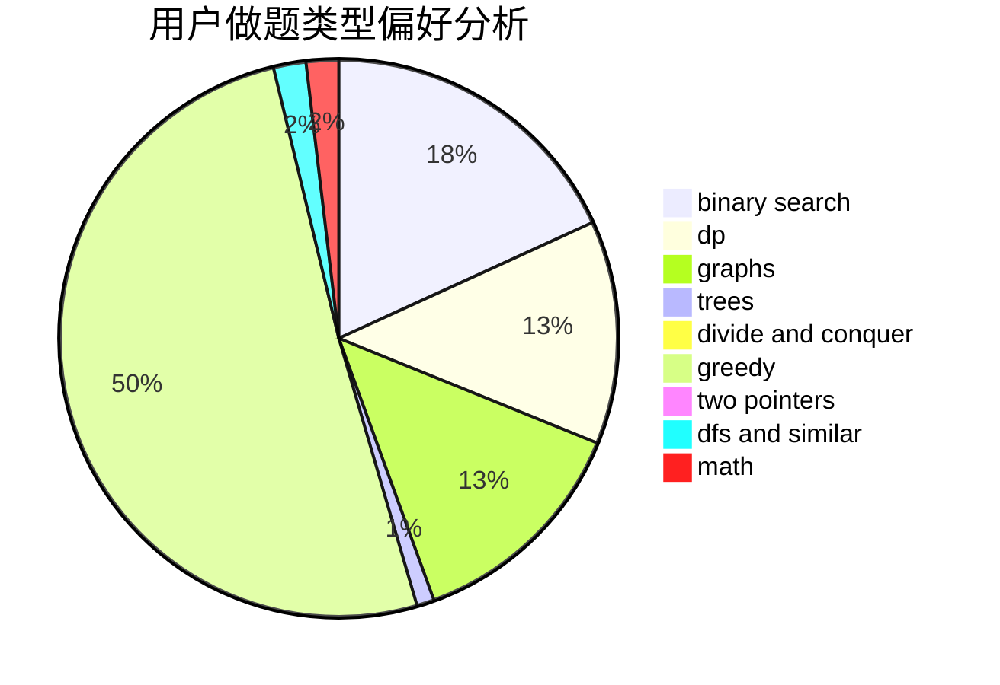

# dc233

<!-- tabs:start -->

#### **用户提交结果分析**

#### **用户做题类型偏好分析**

<!-- tabs:end -->
# 推荐题目
[924D](https://codeforces.com/contest/924/problem/D)
[1307E](https://codeforces.com/contest/1307/problem/E)
[739D](https://codeforces.com/contest/739/problem/D)
[524E](https://codeforces.com/contest/524/problem/E)
[483D](https://codeforces.com/contest/483/problem/D)
[457E](https://codeforces.com/contest/457/problem/E)
[48A](https://codeforces.com/contest/48/problem/A)
[204E](https://codeforces.com/contest/204/problem/E)
[1109D](https://codeforces.com/contest/1109/problem/D)
[1444D](https://codeforces.com/contest/1444/problem/D)
