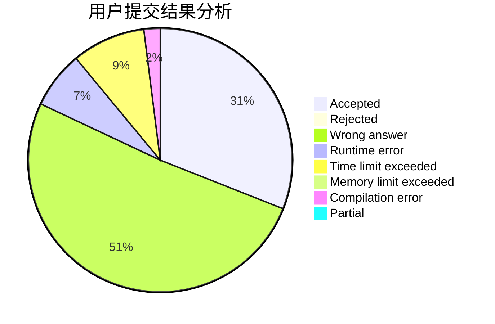
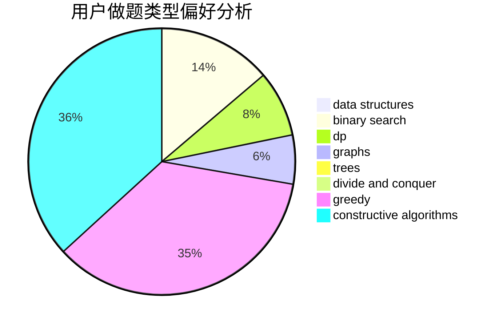
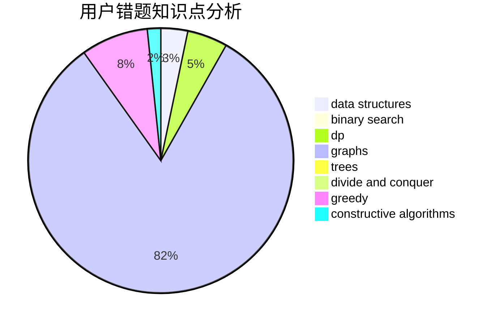

# dc233

<!-- tabs:start -->

#### **用户提交结果分析**

#### **用户做题类型偏好分析**

#### **用户错题知识点分析**

<!-- tabs:end -->
# 推荐题目
[924D](https://codeforces.com/contest/924/problem/D)		nan		  
[1307E](https://codeforces.com/contest/1307/problem/E)		binary search,
                        combinatorics,
                        dp,
                        greedy,
                        implementation,
                        math		  
[739D](https://codeforces.com/contest/739/problem/D)		graph matchings		  
[524E](https://codeforces.com/contest/524/problem/E)		data structures,
                        sortings		  
[483D](https://codeforces.com/contest/483/problem/D)		dsu,graphs,sortings,trees		  
[457E](https://codeforces.com/contest/457/problem/E)		constructive algorithms,
                        flows,
                        math		  
[48A](https://codeforces.com/contest/48/problem/A)		implementation,
                        schedules		  
[204E](https://codeforces.com/contest/204/problem/E)		data structures,
                        implementation,
                        string suffix structures,
                        two pointers		  
[1109D](https://codeforces.com/contest/1109/problem/D)		brute force,
                        combinatorics,
                        dp,
                        math,
                        trees		  
[1444D](https://codeforces.com/contest/1444/problem/D)		constructive algorithms,
                        dp,
                        geometry		  
