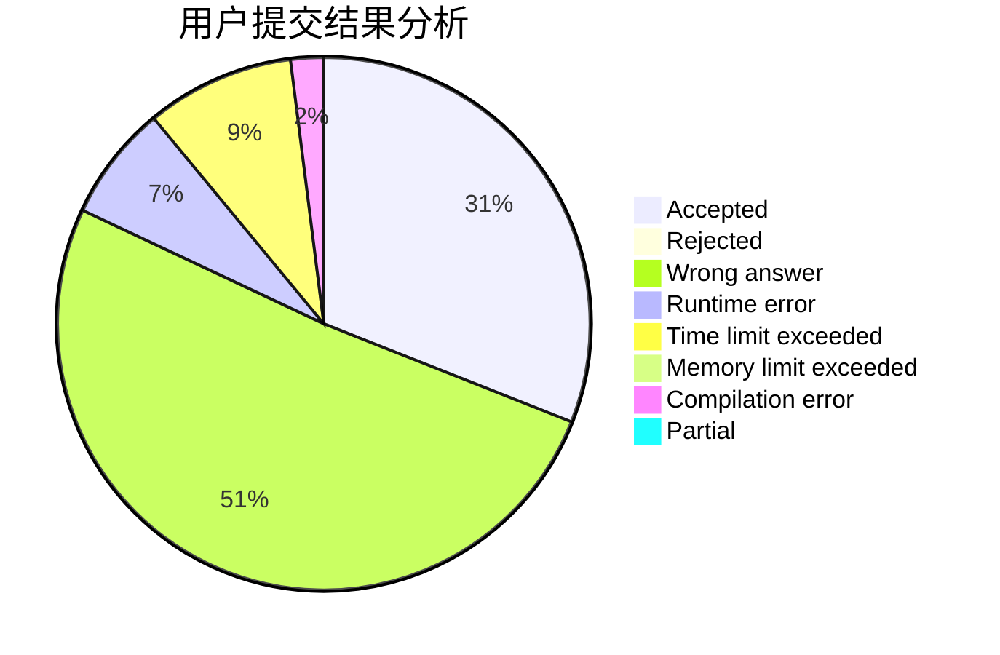
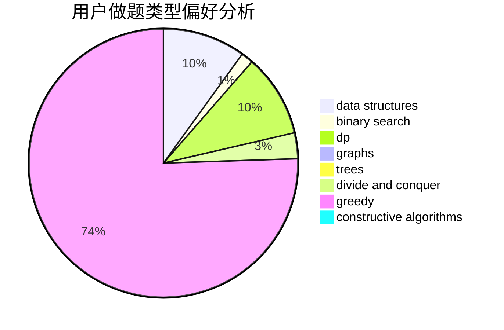
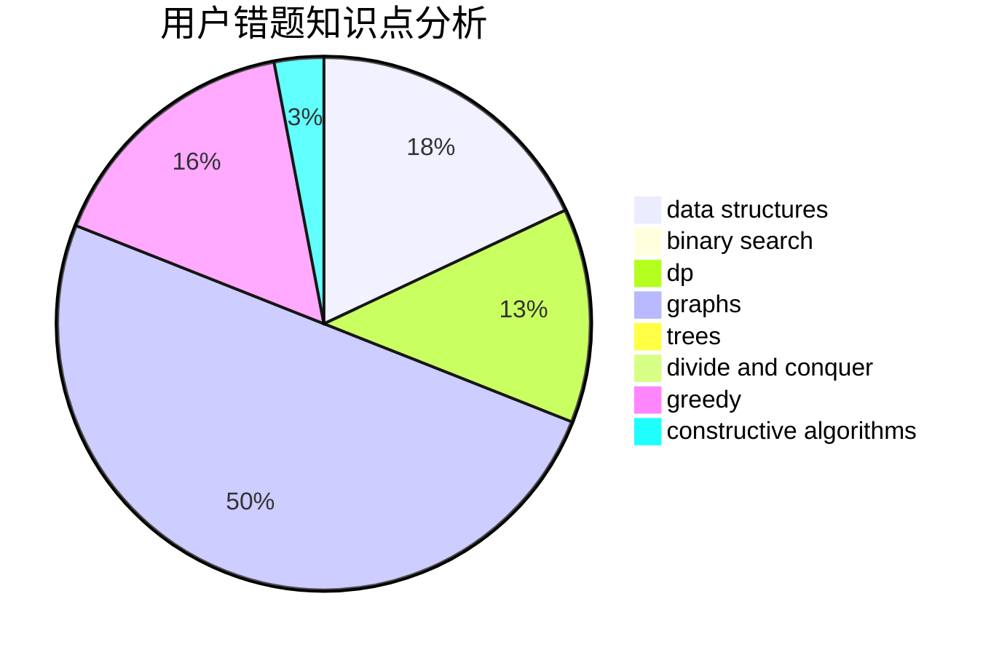

# dc233

<!-- tabs:start -->

#### **用户提交结果分析**

#### **用户做题类型偏好分析**

#### **用户错题知识点分析**

<!-- tabs:end -->
# 推荐题目
[909F](https://codeforces.com/contest/909/problem/F)		constructive algorithms		  
[12D](https://codeforces.com/contest/12/problem/D)		data structures,
                        sortings		  
[722C](https://codeforces.com/contest/722/problem/C)		data structures,
                        dsu		  
[504A](https://codeforces.com/contest/504/problem/A)		dsu,graphs,sortings,trees		  
[463D](https://codeforces.com/contest/463/problem/D)		dfs and similar,
                        dp,
                        graphs,
                        implementation		  
[436E](https://codeforces.com/contest/436/problem/E)		data structures,
                        greedy		  
[471C](https://codeforces.com/contest/471/problem/C)		binary search,
                        brute force,
                        greedy,
                        math		  
[178F2](https://codeforces.com/contest/178F/problem/2)		dp,
                        sortings,
                        strings		  
[1108F](https://codeforces.com/contest/1108/problem/F)		binary search,
                        dsu,
                        graphs,
                        greedy		  
[1434D](https://codeforces.com/contest/1434/problem/D)		dsu,graphs,sortings,trees		  
