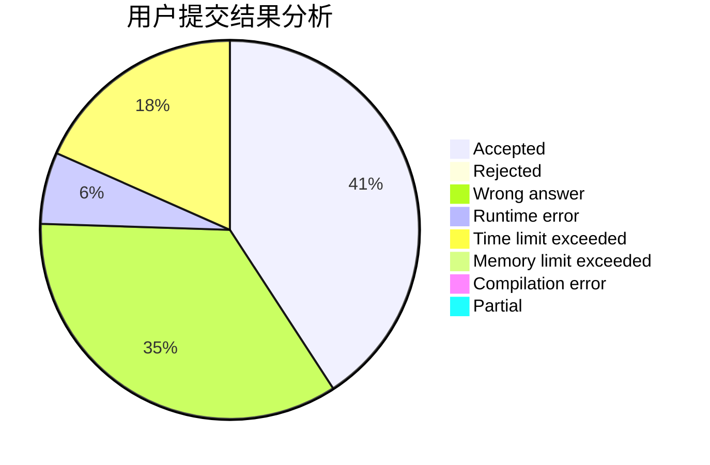
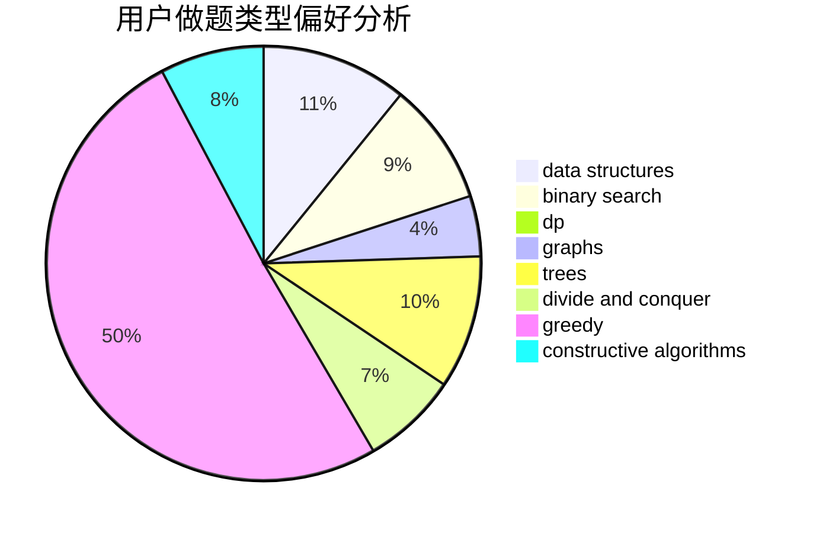
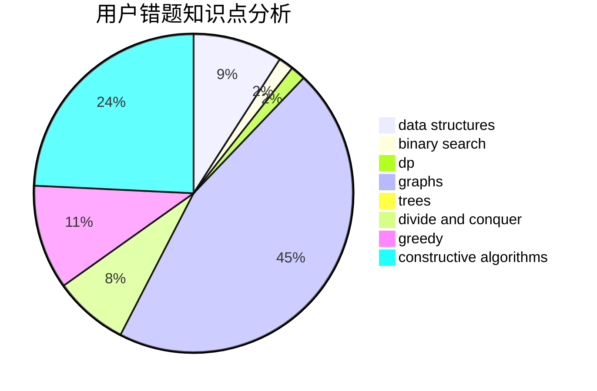

# dcac

<!-- tabs:start -->

#### **用户提交结果分析**

#### **用户做题类型偏好分析**

#### **用户错题知识点分析**

<!-- tabs:end -->
# 推荐题目
[1333E](https://codeforces.com/contest/1333/problem/E)		brute force,
                        constructive algorithms		  
[1143F](https://codeforces.com/contest/1143/problem/F)		dsu,graphs,sortings,trees		  
[75D](https://codeforces.com/contest/75/problem/D)		data structures,
                        dp,
                        greedy,
                        implementation,
                        math,
                        trees		  
[319A](https://codeforces.com/contest/319/problem/A)		combinatorics,
                        math		  
[73C](https://codeforces.com/contest/73/problem/C)		dp		  
[1446C](https://codeforces.com/contest/1446/problem/C)		binary search,
                        bitmasks,
                        data structures,
                        divide and conquer,
                        dp,
                        trees		  
[1020C](https://codeforces.com/contest/1020/problem/C)		dsu,graphs,sortings,trees		  
[268A](https://codeforces.com/contest/268/problem/A)		brute force		  
[1119C](https://codeforces.com/contest/1119/problem/C)		constructive algorithms,
                        greedy,
                        implementation,
                        math		  
[954C](https://codeforces.com/contest/954/problem/C)		implementation		  
