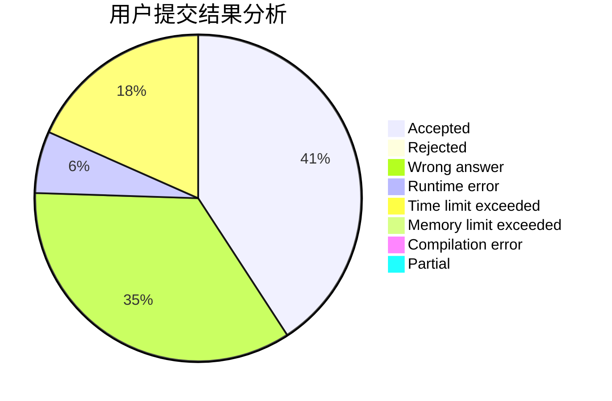
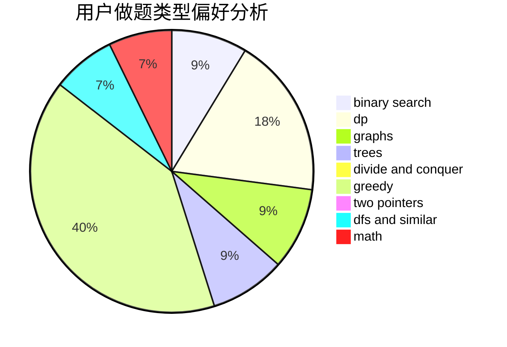

# dcac

<!-- tabs:start -->

#### **用户提交结果分析**

#### **用户做题类型偏好分析**

<!-- tabs:end -->
# 推荐题目
[1340D](https://codeforces.com/contest/1340/problem/D)
[1146A](https://codeforces.com/contest/1146/problem/A)
[77B](https://codeforces.com/contest/77/problem/B)
[349B](https://codeforces.com/contest/349/problem/B)
[761A](https://codeforces.com/contest/761/problem/A)
[1455E](https://codeforces.com/contest/1455/problem/E)
[1023A](https://codeforces.com/contest/1023/problem/A)
[283B](https://codeforces.com/contest/283/problem/B)
[1121C](https://codeforces.com/contest/1121/problem/C)
[976B](https://codeforces.com/contest/976/problem/B)
