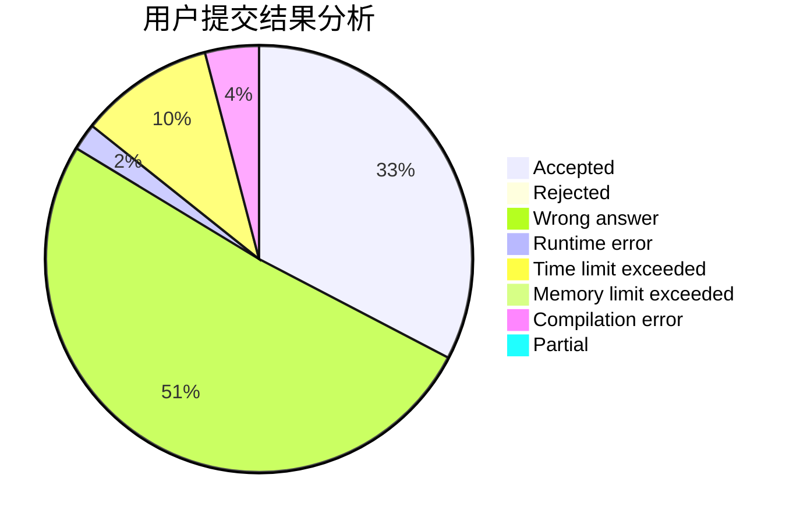
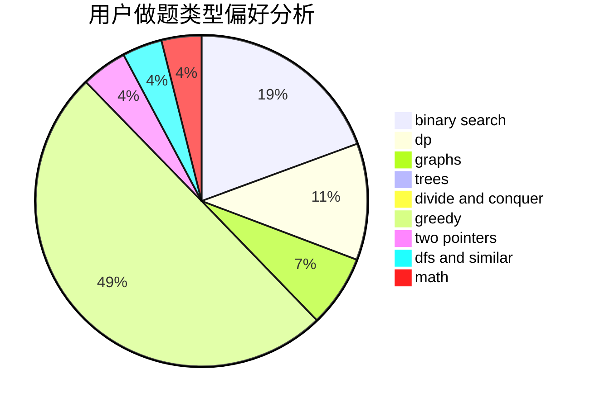

# dcmfqw

<!-- tabs:start -->

#### **用户提交结果分析**

#### **用户做题类型偏好分析**

<!-- tabs:end -->
# 推荐题目
[722D](https://codeforces.com/contest/722/problem/D)
[327A](https://codeforces.com/contest/327/problem/A)
[940A](https://codeforces.com/contest/940/problem/A)
[288E](https://codeforces.com/contest/288/problem/E)
[767A](https://codeforces.com/contest/767/problem/A)
[780E](https://codeforces.com/contest/780/problem/E)
[11951](https://codeforces.com/contest/1195/problem/1)
[699D](https://codeforces.com/contest/699/problem/D)
[338D](https://codeforces.com/contest/338/problem/D)
[117C](https://codeforces.com/contest/117/problem/C)
