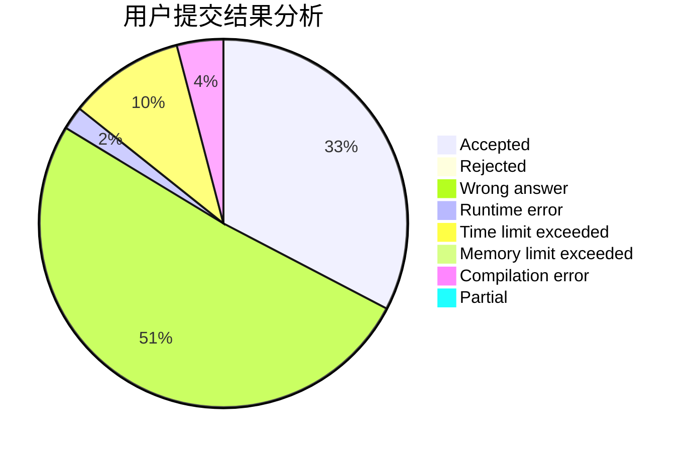
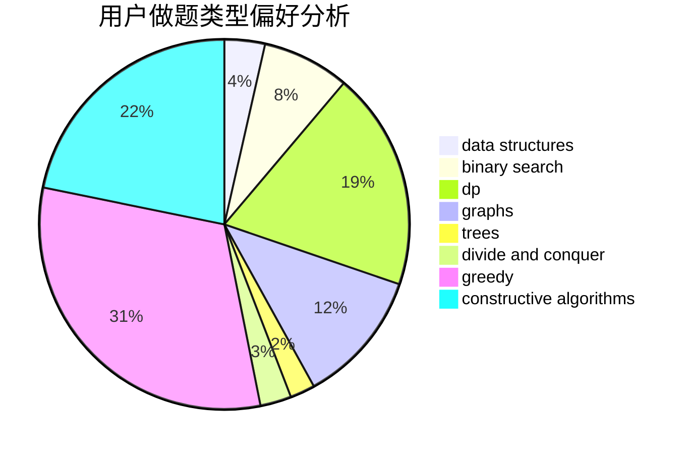
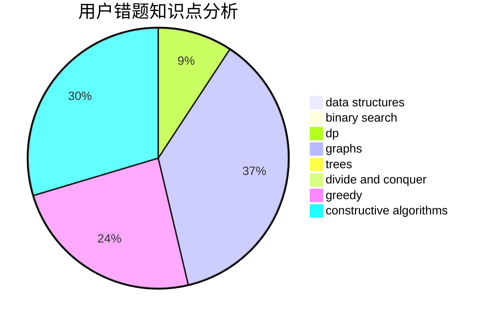

# dcmfqw

<!-- tabs:start -->

#### **用户提交结果分析**

#### **用户做题类型偏好分析**

#### **用户错题知识点分析**

<!-- tabs:end -->
# 推荐题目
[703C](https://codeforces.com/contest/703/problem/C)		geometry,
                        implementation		  
[305D](https://codeforces.com/contest/305/problem/D)		combinatorics,
                        math		  
[920A](https://codeforces.com/contest/920/problem/A)		implementation		  
[272E](https://codeforces.com/contest/272/problem/E)		combinatorics,
                        constructive algorithms,
                        graphs		  
[747D](https://codeforces.com/contest/747/problem/D)		dp,
                        greedy,
                        sortings		  
[762A](https://codeforces.com/contest/762/problem/A)		math,
                        number theory		  
[1189D2](https://codeforces.com/contest/1189D/problem/2)		dsu,graphs,sortings,trees		  
[674G](https://codeforces.com/contest/674/problem/G)		dsu,graphs,sortings,trees		  
[313E](https://codeforces.com/contest/313/problem/E)		constructive algorithms,
                        data structures,
                        dsu,
                        greedy		  
[1176E](https://codeforces.com/contest/1176/problem/E)		dfs and similar,
                        dsu,
                        graphs,
                        shortest paths,
                        trees		  
