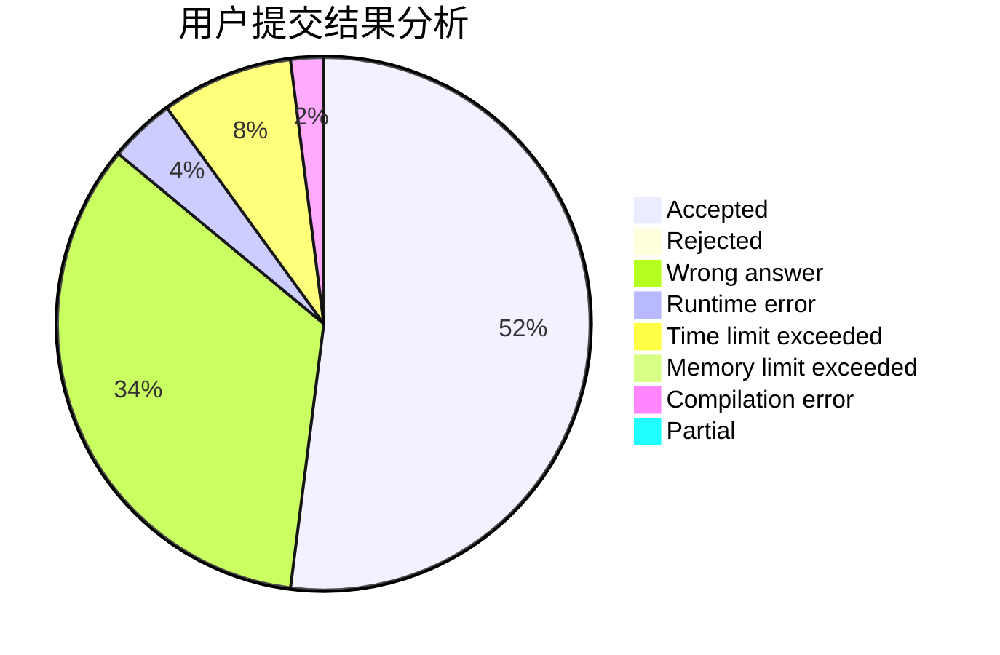
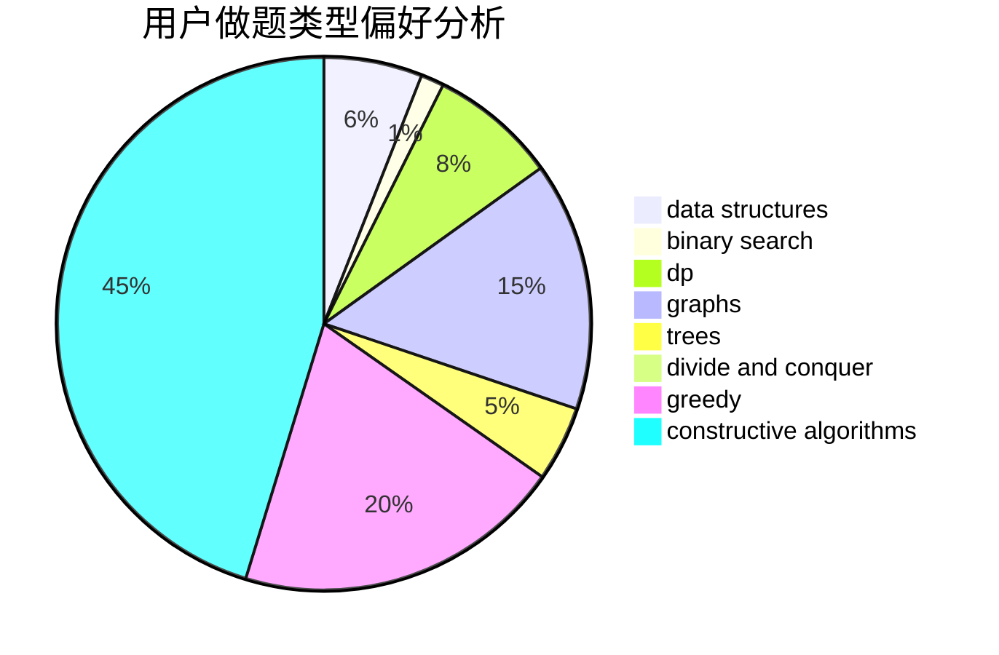
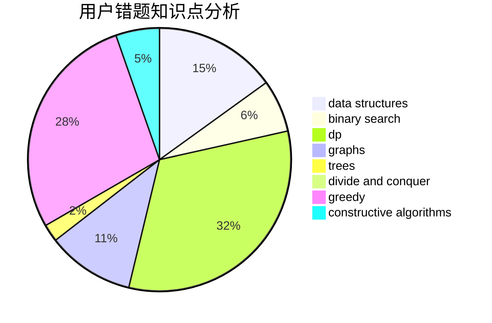

# ddd.

<!-- tabs:start -->

#### **用户提交结果分析**

#### **用户做题类型偏好分析**

#### **用户错题知识点分析**

<!-- tabs:end -->
# 推荐题目
[12612](https://codeforces.com/contest/1261/problem/2)		dsu,graphs,sortings,trees		  
[1143E](https://codeforces.com/contest/1143/problem/E)		dsu,graphs,sortings,trees		  
[1277B](https://codeforces.com/contest/1277/problem/B)		greedy,
                        number theory		  
[1488C](https://codeforces.com/contest/1488/problem/C)		*special problem,
                        binary search,
                        brute force,
                        math		  
[978C](https://codeforces.com/contest/978/problem/C)		binary search,
                        implementation,
                        two pointers		  
[1298E](https://codeforces.com/contest/1298/problem/E)		dsu,graphs,sortings,trees		  
[584E](https://codeforces.com/contest/584/problem/E)		constructive algorithms,
                        greedy,
                        math		  
[740A](https://codeforces.com/contest/740/problem/A)		brute force,
                        implementation		  
[1104E](https://codeforces.com/contest/1104/problem/E)		dsu,graphs,sortings,trees		  
[759A](https://codeforces.com/contest/759/problem/A)		dsu,graphs,sortings,trees		  
