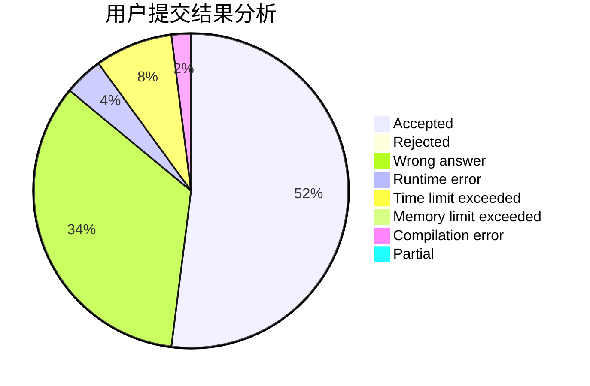
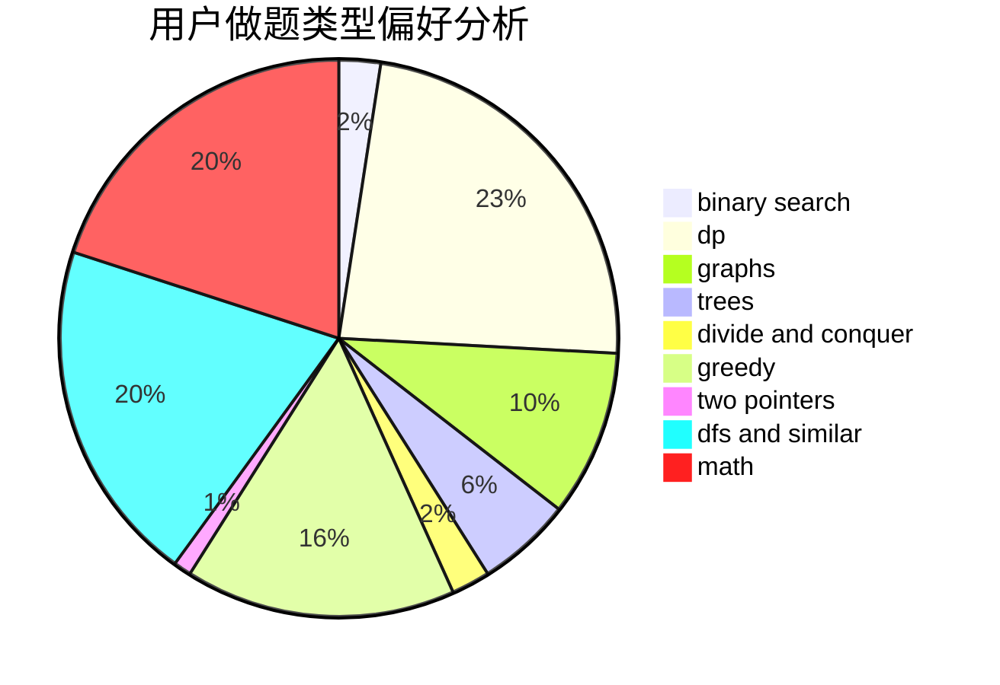

# ddd.

<!-- tabs:start -->

#### **用户提交结果分析**

#### **用户做题类型偏好分析**

<!-- tabs:end -->
# 推荐题目
[12612](https://codeforces.com/contest/1261/problem/2)
[1143E](https://codeforces.com/contest/1143/problem/E)
[1277B](https://codeforces.com/contest/1277/problem/B)
[1488C](https://codeforces.com/contest/1488/problem/C)
[978C](https://codeforces.com/contest/978/problem/C)
[1298E](https://codeforces.com/contest/1298/problem/E)
[584E](https://codeforces.com/contest/584/problem/E)
[740A](https://codeforces.com/contest/740/problem/A)
[1104E](https://codeforces.com/contest/1104/problem/E)
[759A](https://codeforces.com/contest/759/problem/A)
