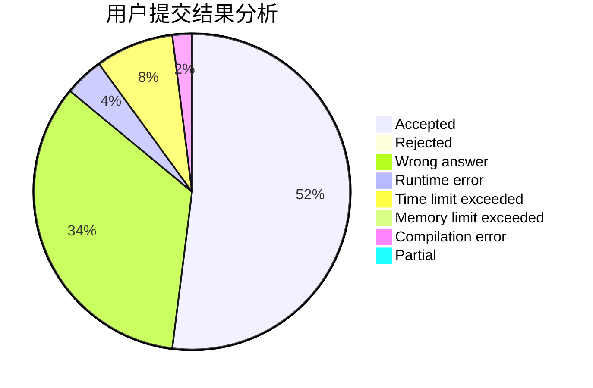
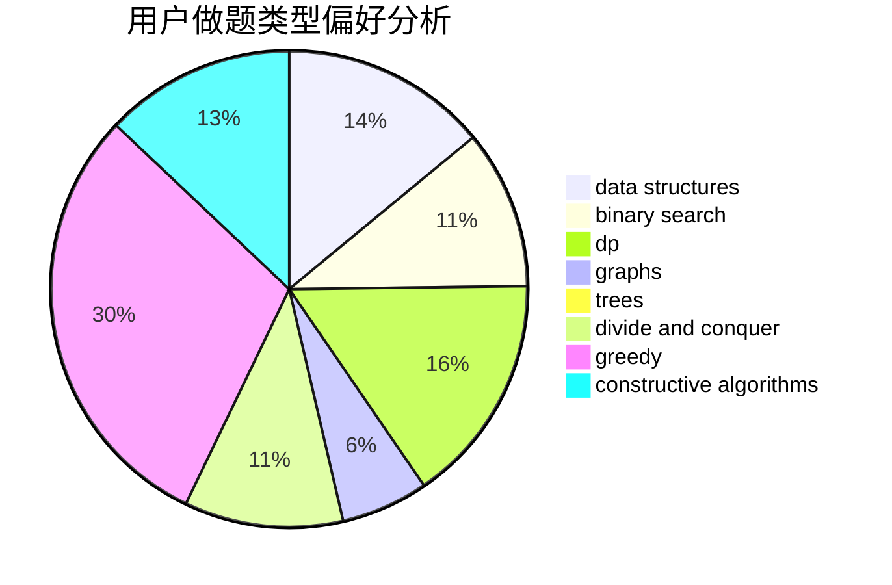
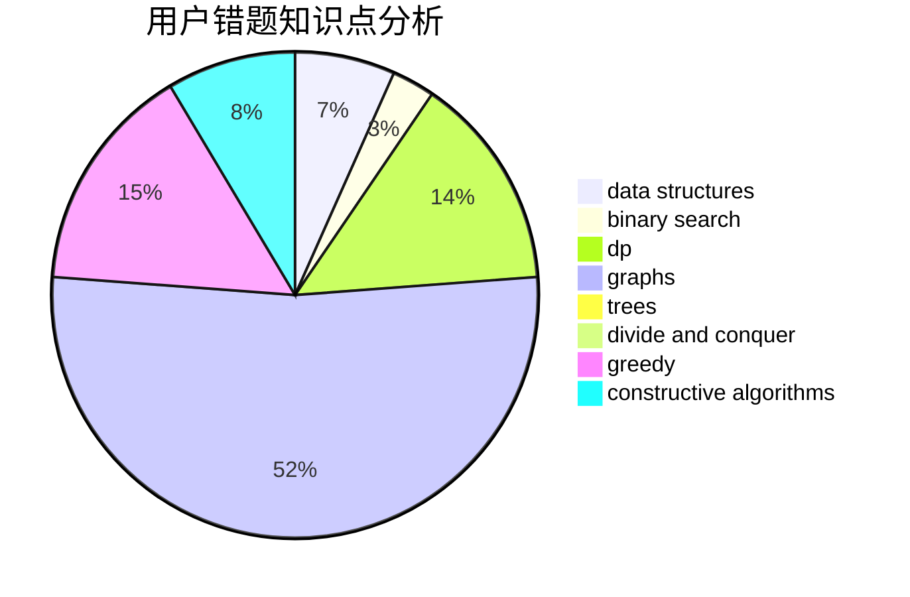

# ddd.

<!-- tabs:start -->

#### **用户提交结果分析**

#### **用户做题类型偏好分析**

#### **用户错题知识点分析**

<!-- tabs:end -->
# 推荐题目
[1253F](https://codeforces.com/contest/1253/problem/F)		binary search,
                        dsu,
                        graphs,
                        shortest paths,
                        trees		  
[1141E](https://codeforces.com/contest/1141/problem/E)		math		  
[1268A](https://codeforces.com/contest/1268/problem/A)		constructive algorithms,
                        greedy,
                        implementation,
                        strings		  
[1479E](https://codeforces.com/contest/1479/problem/E)		dp,
                        fft,
                        math,
                        number theory,
                        probabilities		  
[956F](https://codeforces.com/contest/956/problem/F)		dsu,graphs,sortings,trees		  
[1291F](https://codeforces.com/contest/1291/problem/F)		graphs,
                        interactive		  
[566A](https://codeforces.com/contest/566/problem/A)		dfs and similar,
                        strings,
                        trees		  
[723B](https://codeforces.com/contest/723/problem/B)		expression parsing,
                        implementation,
                        strings		  
[1104B](https://codeforces.com/contest/1104/problem/B)		data structures,
                        implementation,
                        math		  
[737C](https://codeforces.com/contest/737/problem/C)		dsu,graphs,sortings,trees		  
