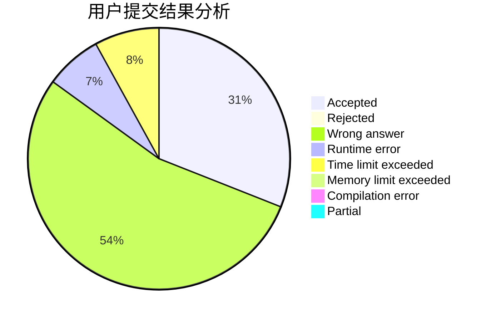
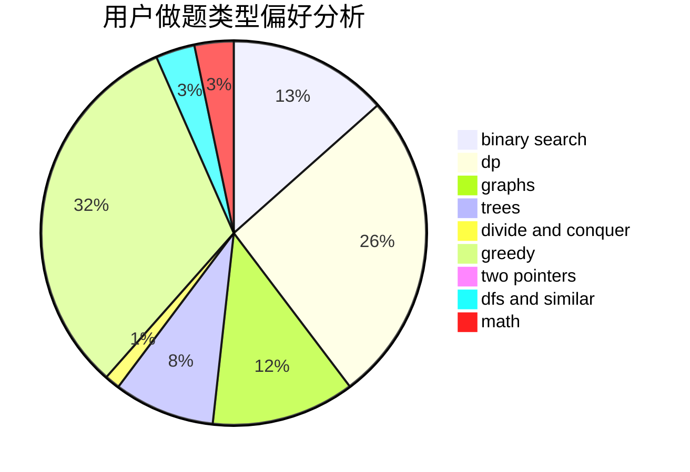

# ddxm

<!-- tabs:start -->

#### **用户提交结果分析**

#### **用户做题类型偏好分析**

<!-- tabs:end -->
# 推荐题目
[124A](https://codeforces.com/contest/124/problem/A)
[585B](https://codeforces.com/contest/585/problem/B)
[1220C](https://codeforces.com/contest/1220/problem/C)
[429A](https://codeforces.com/contest/429/problem/A)
[1055D](https://codeforces.com/contest/1055/problem/D)
[778C](https://codeforces.com/contest/778/problem/C)
[243D](https://codeforces.com/contest/243/problem/D)
[659G](https://codeforces.com/contest/659/problem/G)
[443D](https://codeforces.com/contest/443/problem/D)
[809C](https://codeforces.com/contest/809/problem/C)
