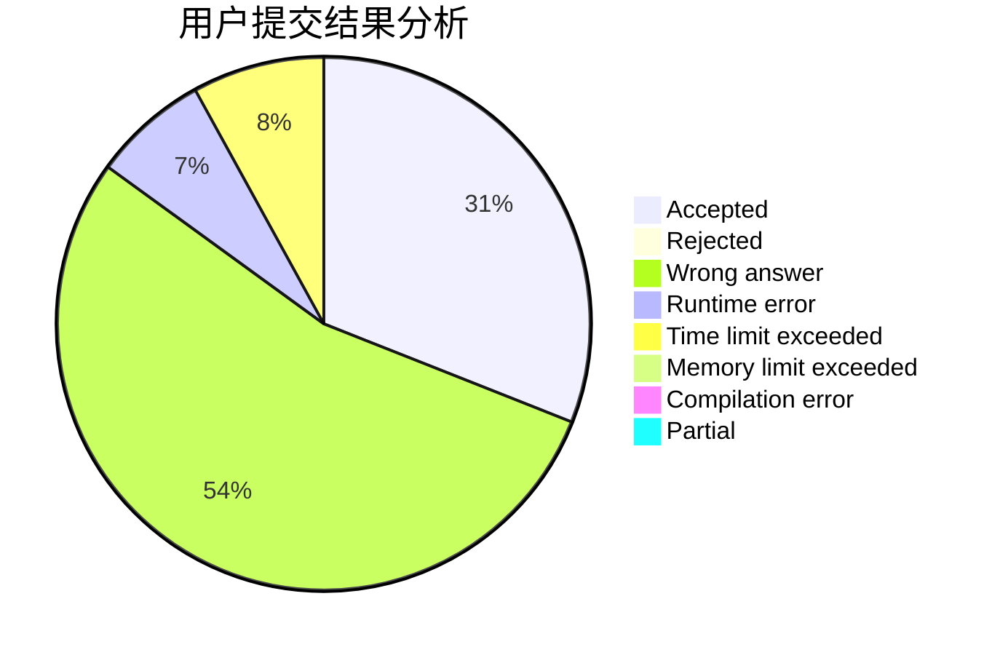
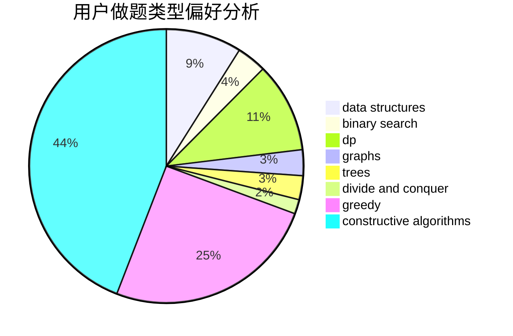
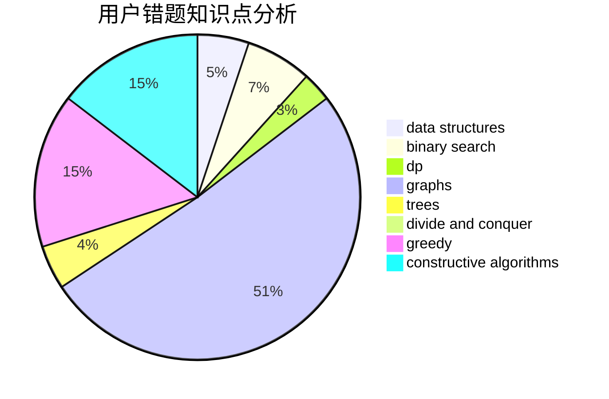

# ddxm

<!-- tabs:start -->

#### **用户提交结果分析**

#### **用户做题类型偏好分析**

#### **用户错题知识点分析**

<!-- tabs:end -->
# 推荐题目
[1244E](https://codeforces.com/contest/1244/problem/E)		binary search,
                        constructive algorithms,
                        greedy,
                        sortings,
                        ternary search,
                        two pointers		  
[566C](https://codeforces.com/contest/566/problem/C)		dfs and similar,
                        divide and conquer,
                        trees		  
[1214G](https://codeforces.com/contest/1214/problem/G)		bitmasks,
                        data structures		  
[39J](https://codeforces.com/contest/39/problem/J)		hashing,
                        implementation,
                        strings		  
[1055A](https://codeforces.com/contest/1055/problem/A)		graphs		  
[759A](https://codeforces.com/contest/759/problem/A)		dsu,graphs,sortings,trees		  
[225D](https://codeforces.com/contest/225/problem/D)		bitmasks,
                        dfs and similar,
                        graphs,
                        implementation		  
[62E](https://codeforces.com/contest/62/problem/E)		dp,
                        flows		  
[418C](https://codeforces.com/contest/418/problem/C)		dsu,graphs,sortings,trees		  
[794B](https://codeforces.com/contest/794/problem/B)		geometry,
                        math		  
