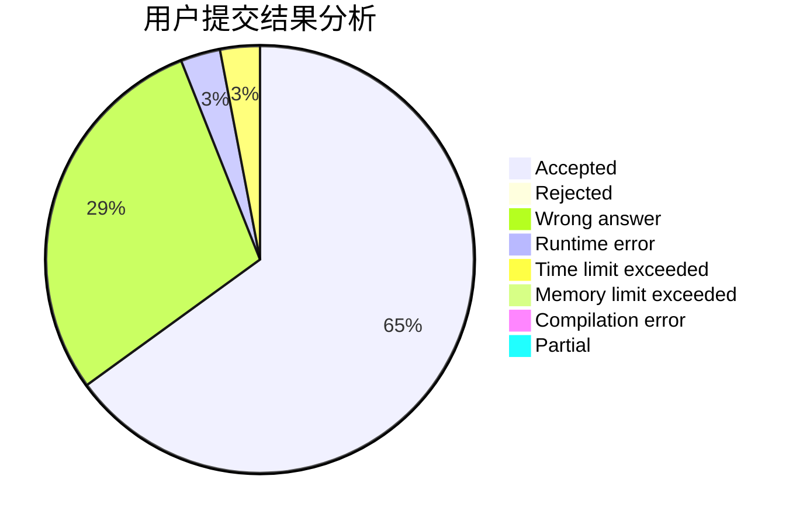
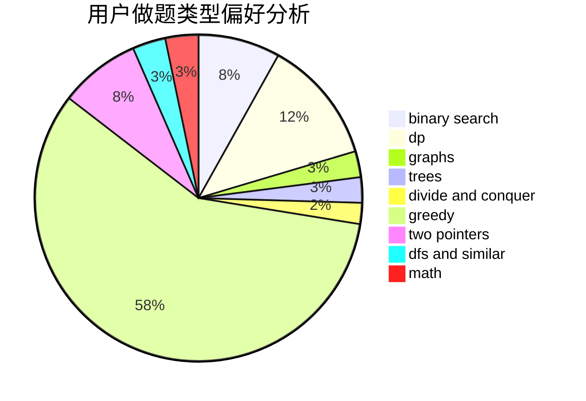

# deknus

<!-- tabs:start -->

#### **用户提交结果分析**

#### **用户做题类型偏好分析**

<!-- tabs:end -->
# 推荐题目
[1506E](https://codeforces.com/contest/1506/problem/E)
[720D](https://codeforces.com/contest/720/problem/D)
[1033G](https://codeforces.com/contest/1033/problem/G)
[1238G](https://codeforces.com/contest/1238/problem/G)
[780E](https://codeforces.com/contest/780/problem/E)
[1113A](https://codeforces.com/contest/1113/problem/A)
[784C](https://codeforces.com/contest/784/problem/C)
[710C](https://codeforces.com/contest/710/problem/C)
[251A](https://codeforces.com/contest/251/problem/A)
[106A](https://codeforces.com/contest/106/problem/A)
