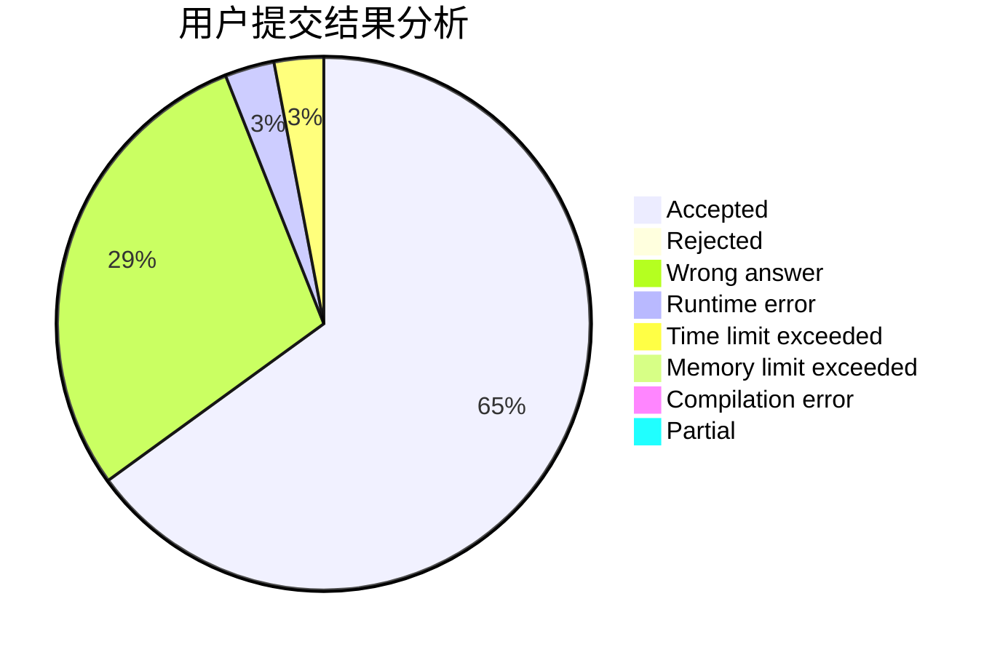
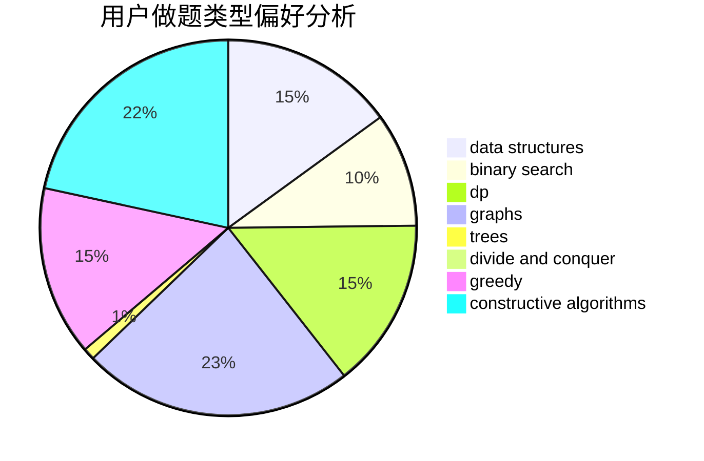
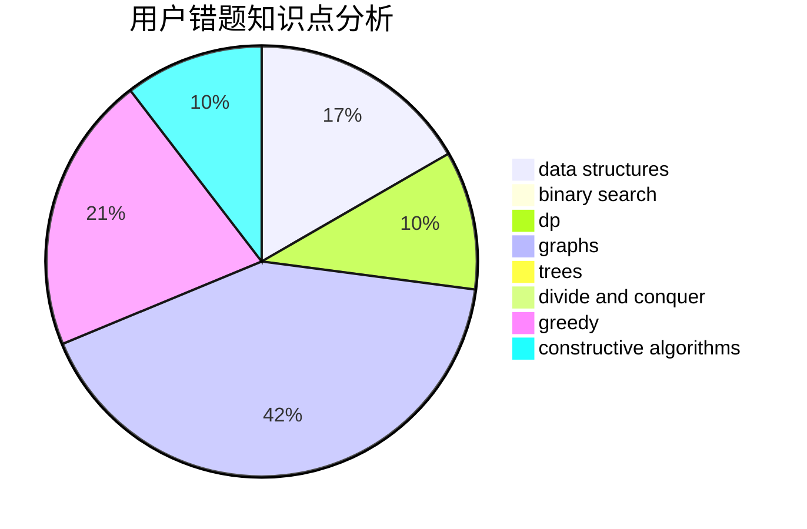

# deknus

<!-- tabs:start -->

#### **用户提交结果分析**

#### **用户做题类型偏好分析**

#### **用户错题知识点分析**

<!-- tabs:end -->
# 推荐题目
[1498A](https://codeforces.com/contest/1498/problem/A)		brute force,
                        math		  
[702A](https://codeforces.com/contest/702/problem/A)		dp,
                        greedy,
                        implementation		  
[1033D](https://codeforces.com/contest/1033/problem/D)		interactive,
                        math,
                        number theory		  
[1230C](https://codeforces.com/contest/1230/problem/C)		dsu,graphs,sortings,trees		  
[762A](https://codeforces.com/contest/762/problem/A)		math,
                        number theory		  
[1111B](https://codeforces.com/contest/1111/problem/B)		brute force,
                        implementation,
                        math		  
[764E](https://codeforces.com/contest/764/problem/E)		dsu,graphs,sortings,trees		  
[690A2](https://codeforces.com/contest/690A/problem/2)		nan		  
[22C](https://codeforces.com/contest/22/problem/C)		graphs		  
[1068C](https://codeforces.com/contest/1068/problem/C)		constructive algorithms,
                        graphs		  
