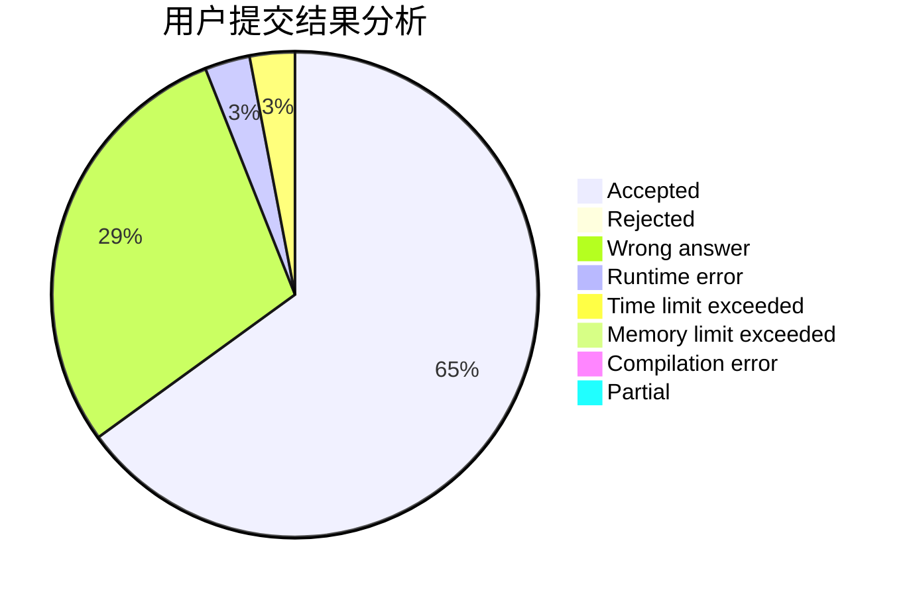
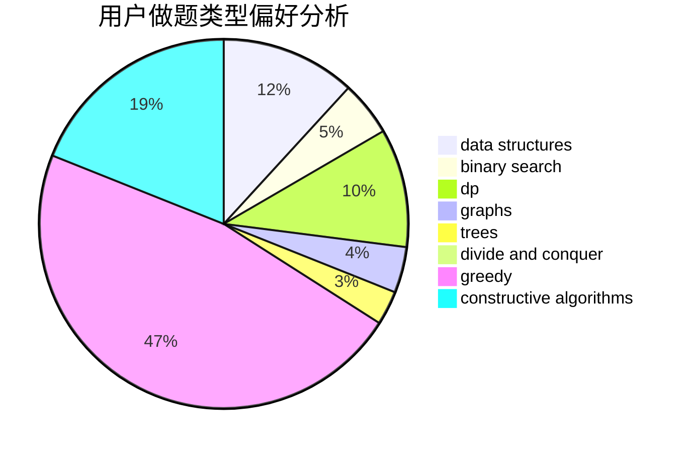
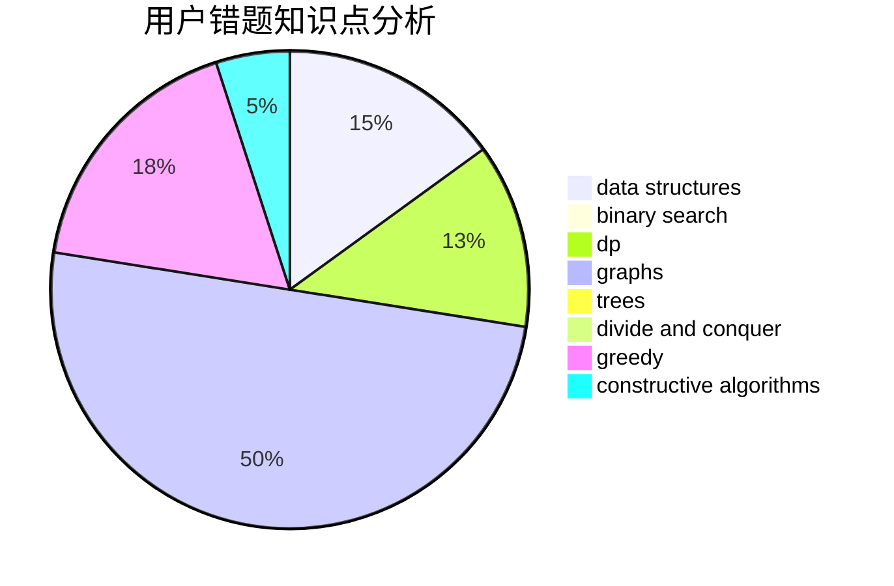

# deknus

<!-- tabs:start -->

#### **用户提交结果分析**

#### **用户做题类型偏好分析**

#### **用户错题知识点分析**

<!-- tabs:end -->
# 推荐题目
[1506E](https://codeforces.com/contest/1506/problem/E)		constructive algorithms,
                        implementation		  
[720D](https://codeforces.com/contest/720/problem/D)		data structures,
                        dp,
                        sortings		  
[1033G](https://codeforces.com/contest/1033/problem/G)		games		  
[1238G](https://codeforces.com/contest/1238/problem/G)		data structures,
                        greedy,
                        sortings		  
[780E](https://codeforces.com/contest/780/problem/E)		constructive algorithms,
                        dfs and similar,
                        graphs		  
[1113A](https://codeforces.com/contest/1113/problem/A)		dp,
                        greedy,
                        math		  
[784C](https://codeforces.com/contest/784/problem/C)		*special problem,
                        implementation		  
[710C](https://codeforces.com/contest/710/problem/C)		constructive algorithms,
                        math		  
[251A](https://codeforces.com/contest/251/problem/A)		binary search,
                        combinatorics,
                        two pointers		  
[106A](https://codeforces.com/contest/106/problem/A)		implementation		  
