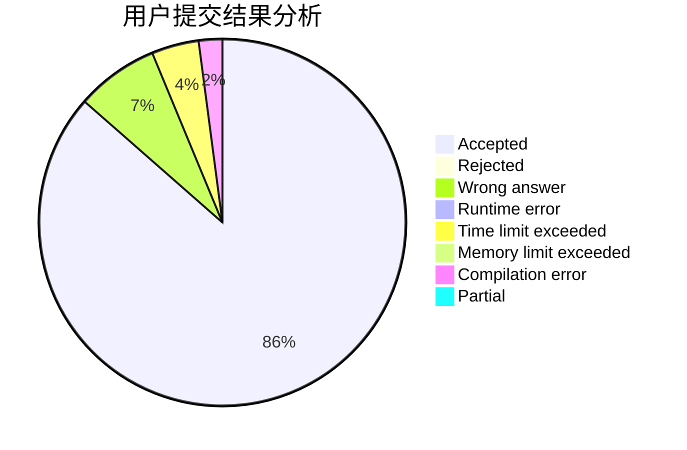
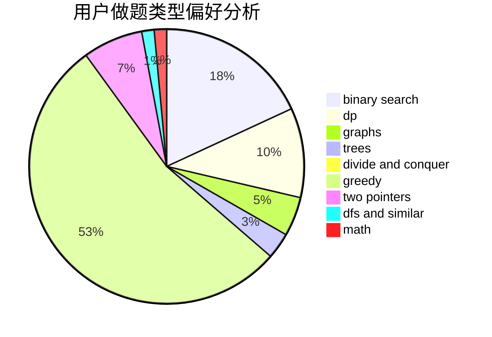

# delta_X

<!-- tabs:start -->

#### **用户提交结果分析**

#### **用户做题类型偏好分析**

<!-- tabs:end -->
# 推荐题目
[1488F](https://codeforces.com/contest/1488/problem/F)
[1111E](https://codeforces.com/contest/1111/problem/E)
[215E](https://codeforces.com/contest/215/problem/E)
[383E](https://codeforces.com/contest/383/problem/E)
[740A](https://codeforces.com/contest/740/problem/A)
[637B](https://codeforces.com/contest/637/problem/B)
[1470E](https://codeforces.com/contest/1470/problem/E)
[1031B](https://codeforces.com/contest/1031/problem/B)
[296B](https://codeforces.com/contest/296/problem/B)
[1185A](https://codeforces.com/contest/1185/problem/A)
