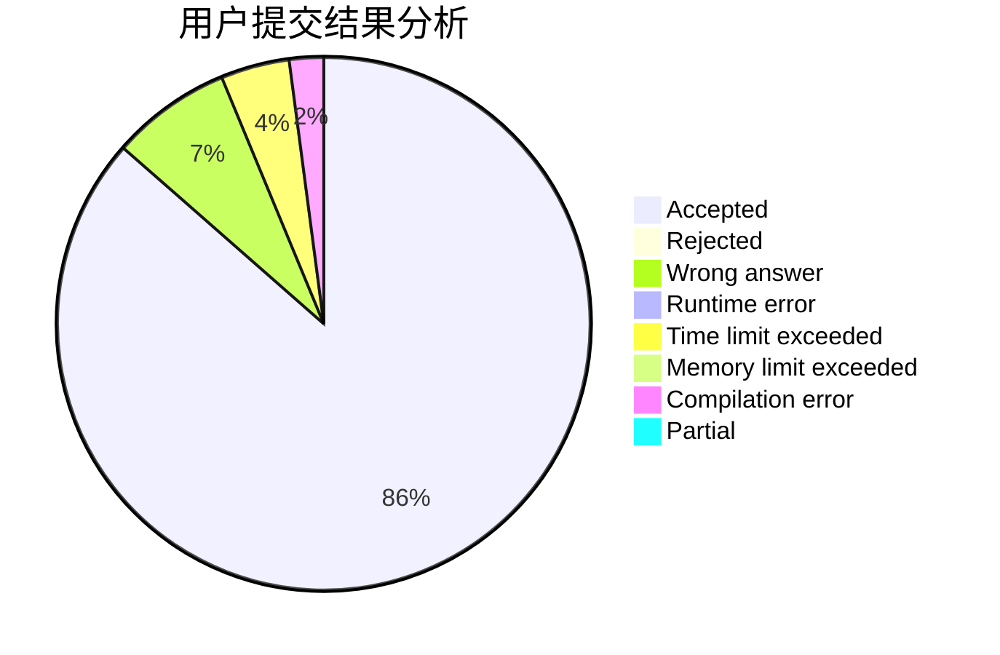
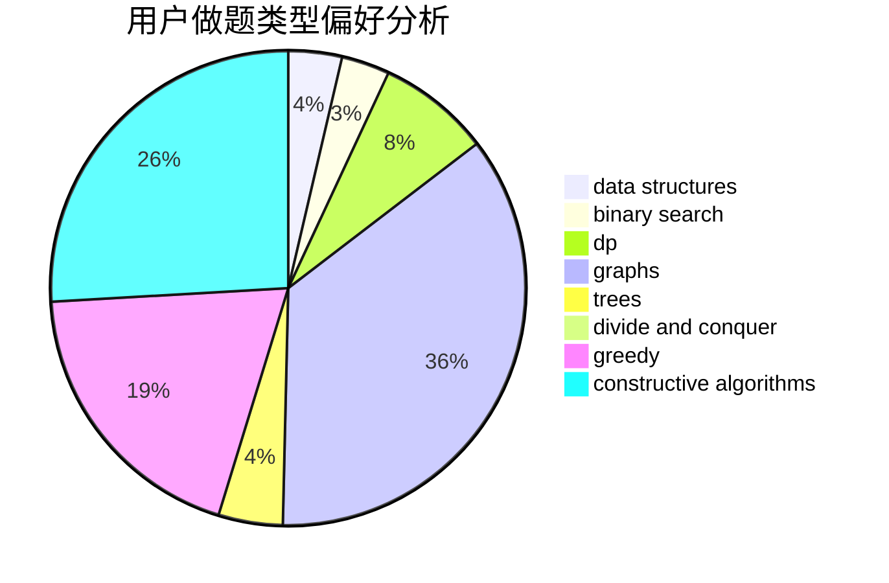
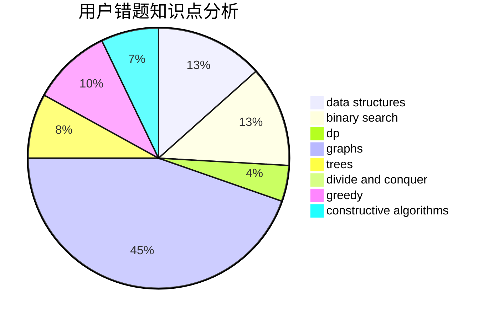

# delta_X

<!-- tabs:start -->

#### **用户提交结果分析**

#### **用户做题类型偏好分析**

#### **用户错题知识点分析**

<!-- tabs:end -->
# 推荐题目
[1480B](https://codeforces.com/contest/1480/problem/B)		greedy,
                        implementation,
                        sortings		  
[1111A](https://codeforces.com/contest/1111/problem/A)		implementation,
                        strings		  
[190E](https://codeforces.com/contest/190/problem/E)		data structures,
                        dsu,
                        graphs,
                        hashing,
                        sortings		  
[358D](https://codeforces.com/contest/358/problem/D)		dp,
                        greedy		  
[723B](https://codeforces.com/contest/723/problem/B)		expression parsing,
                        implementation,
                        strings		  
[618A](https://codeforces.com/contest/618/problem/A)		implementation		  
[1463D](https://codeforces.com/contest/1463/problem/D)		binary search,
                        constructive algorithms,
                        greedy,
                        two pointers		  
[1030E](https://codeforces.com/contest/1030/problem/E)		bitmasks,
                        dp		  
[280B](https://codeforces.com/contest/280/problem/B)		data structures,
                        implementation,
                        two pointers		  
[1182E](https://codeforces.com/contest/1182/problem/E)		dp,
                        math,
                        matrices,
                        number theory		  
