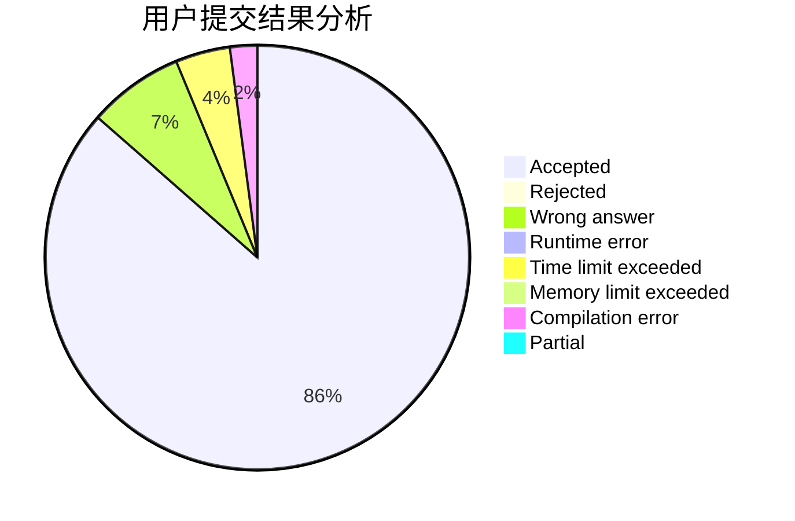
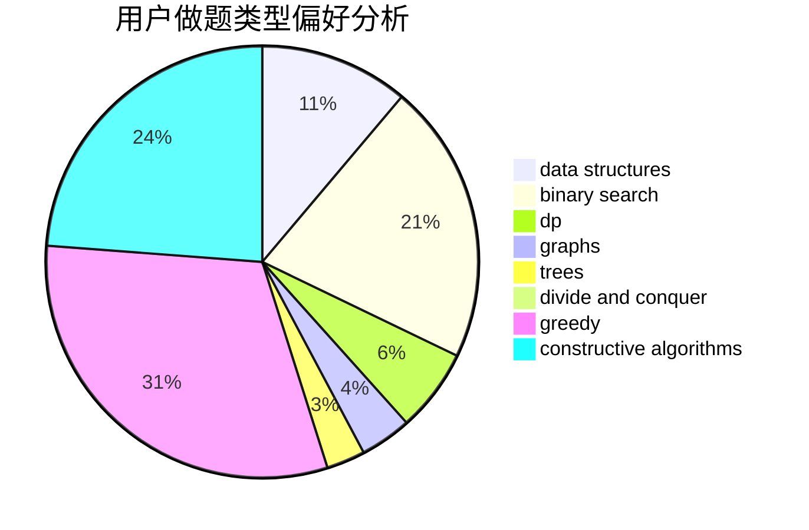
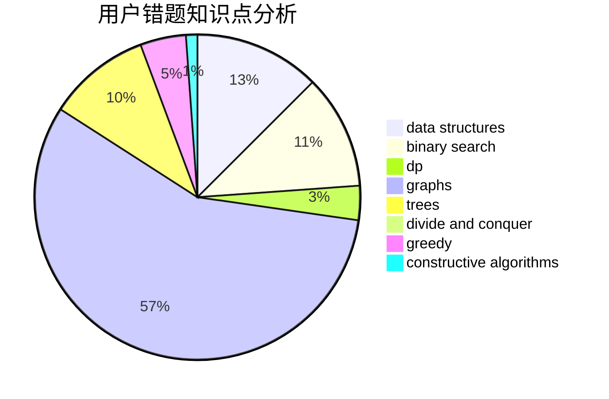

# delta_X

<!-- tabs:start -->

#### **用户提交结果分析**

#### **用户做题类型偏好分析**

#### **用户错题知识点分析**

<!-- tabs:end -->
# 推荐题目
[1488F](https://codeforces.com/contest/1488/problem/F)		*special problem,
                        *special problem,
                        binary search,
                        data structures		  
[1111E](https://codeforces.com/contest/1111/problem/E)		data structures,
                        dfs and similar,
                        dp,
                        graphs,
                        trees		  
[215E](https://codeforces.com/contest/215/problem/E)		combinatorics,
                        dp,
                        number theory		  
[383E](https://codeforces.com/contest/383/problem/E)		combinatorics,
                        divide and conquer,
                        dp		  
[740A](https://codeforces.com/contest/740/problem/A)		brute force,
                        implementation		  
[637B](https://codeforces.com/contest/637/problem/B)		*special problem,
                        binary search,
                        constructive algorithms,
                        data structures,
                        sortings		  
[1470E](https://codeforces.com/contest/1470/problem/E)		binary search,
                        combinatorics,
                        data structures,
                        dp,
                        graphs,
                        implementation,
                        two pointers		  
[1031B](https://codeforces.com/contest/1031/problem/B)		nan		  
[296B](https://codeforces.com/contest/296/problem/B)		combinatorics,
                        dp		  
[1185A](https://codeforces.com/contest/1185/problem/A)		math		  
