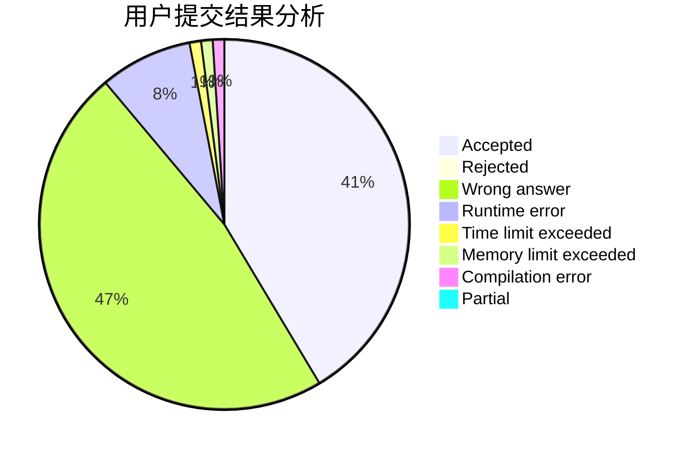
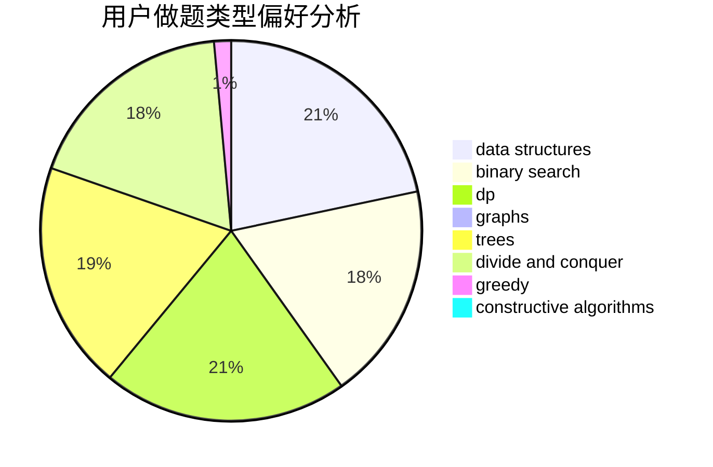
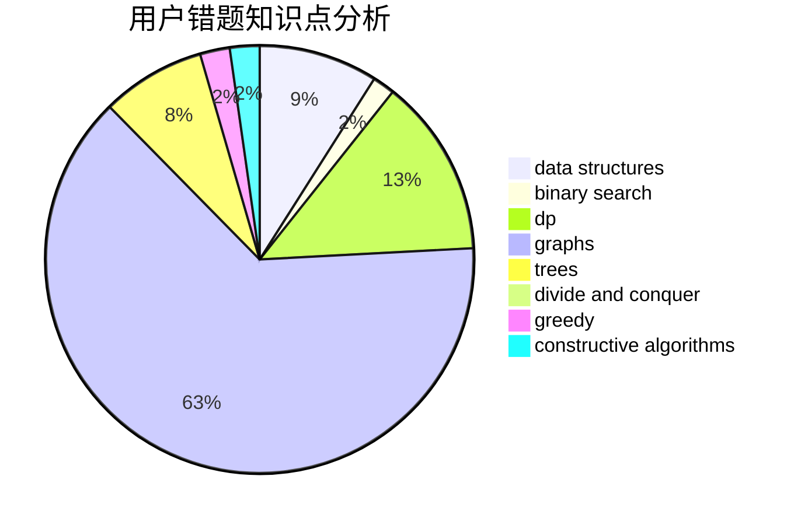

# 11231123

<!-- tabs:start -->

#### **用户提交结果分析**

#### **用户做题类型偏好分析**

#### **用户错题知识点分析**

<!-- tabs:end -->
# 推荐题目
[1101D](https://codeforces.com/contest/1101/problem/D)		data structures,
                        dfs and similar,
                        dp,
                        number theory,
                        trees		  
[1102B](https://codeforces.com/contest/1102/problem/B)		greedy,
                        sortings		  
[1102E](https://codeforces.com/contest/1102/problem/E)		combinatorics,
                        sortings		  
[1101E](https://codeforces.com/contest/1101/problem/E)		implementation		  
[1103D](https://codeforces.com/contest/1103/problem/D)		bitmasks,
                        dp		  
[1103B](https://codeforces.com/contest/1103/problem/B)		binary search,
                        constructive algorithms,
                        interactive		  
[1102D](https://codeforces.com/contest/1102/problem/D)		greedy,
                        strings		  
[1101G](https://codeforces.com/contest/1101/problem/G)		math,
                        matrices		  
[1104A](https://codeforces.com/contest/1104/problem/A)		constructive algorithms,
                        implementation,
                        math		  
[1102F](https://codeforces.com/contest/1102/problem/F)		binary search,
                        bitmasks,
                        brute force,
                        dp,
                        graphs		  
