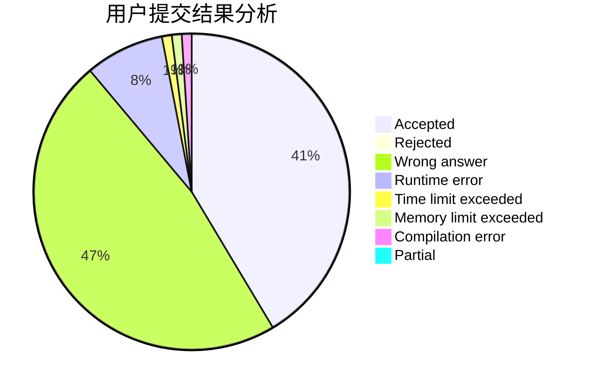
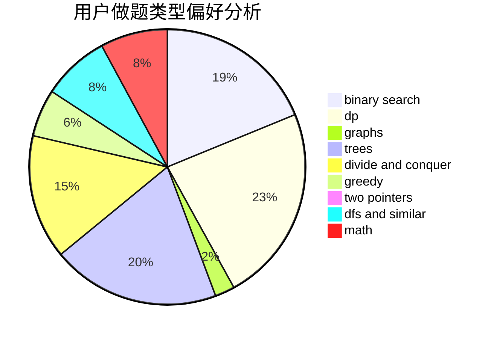

# 11231123

<!-- tabs:start -->

#### **用户提交结果分析**

#### **用户做题类型偏好分析**

<!-- tabs:end -->
# 推荐题目
[1101D](https://codeforces.com/contest/1101/problem/D)
[1102B](https://codeforces.com/contest/1102/problem/B)
[1102E](https://codeforces.com/contest/1102/problem/E)
[1101E](https://codeforces.com/contest/1101/problem/E)
[1103D](https://codeforces.com/contest/1103/problem/D)
[1103B](https://codeforces.com/contest/1103/problem/B)
[1102D](https://codeforces.com/contest/1102/problem/D)
[1101G](https://codeforces.com/contest/1101/problem/G)
[1104A](https://codeforces.com/contest/1104/problem/A)
[1102F](https://codeforces.com/contest/1102/problem/F)
