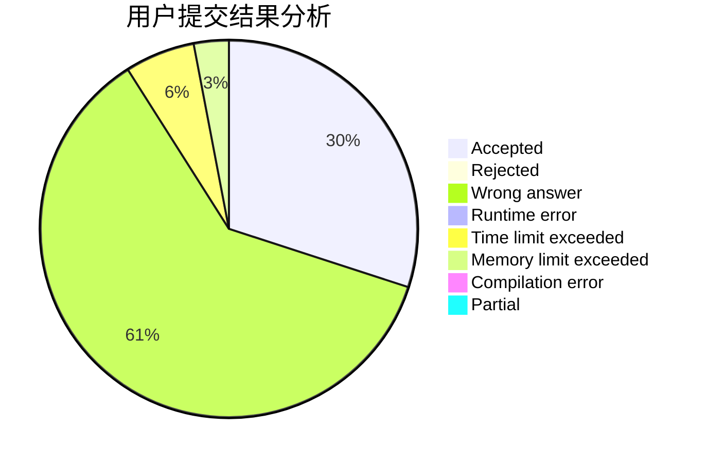
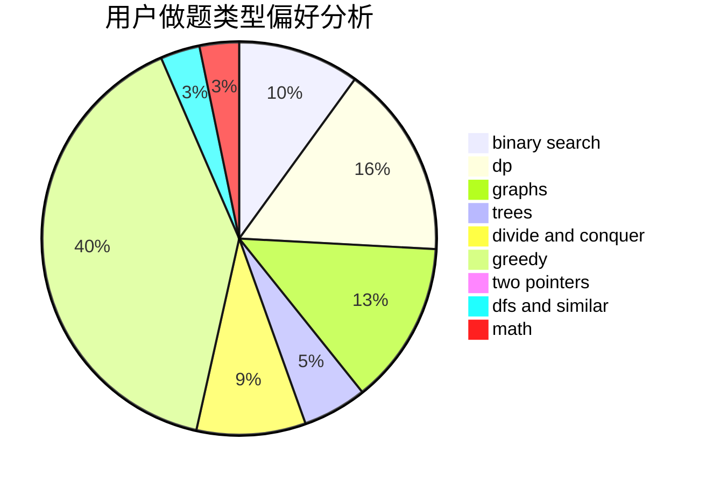

# Aromyase

<!-- tabs:start -->

#### **用户提交结果分析**

#### **用户做题类型偏好分析**

<!-- tabs:end -->
# 推荐题目
[1392D](https://codeforces.com/contest/1392/problem/D)
[1384A](https://codeforces.com/contest/1384/problem/A)
[1498A](https://codeforces.com/contest/1498/problem/A)
[1423C](https://codeforces.com/contest/1423/problem/C)
[442B](https://codeforces.com/contest/442/problem/B)
[441D](https://codeforces.com/contest/441/problem/D)
[376A](https://codeforces.com/contest/376/problem/A)
[441C](https://codeforces.com/contest/441/problem/C)
[300E](https://codeforces.com/contest/300/problem/E)
[1395F](https://codeforces.com/contest/1395/problem/F)
