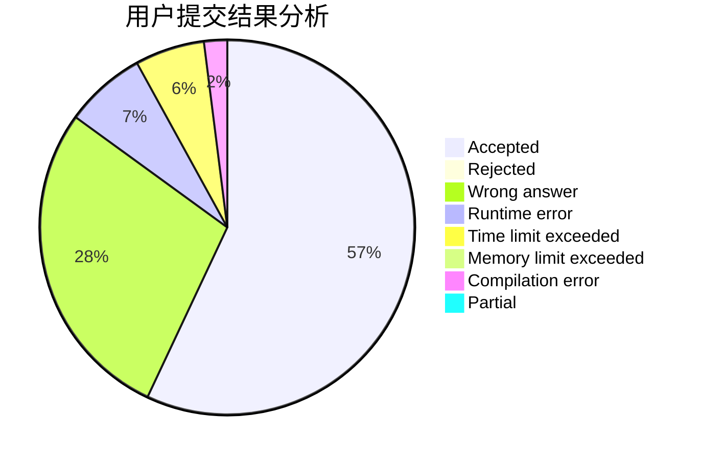
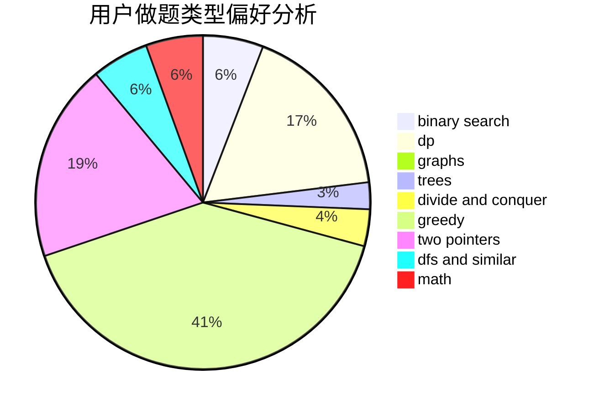

# dengyaotriangle

<!-- tabs:start -->

#### **用户提交结果分析**

#### **用户做题类型偏好分析**

<!-- tabs:end -->
# 推荐题目
[1106E](https://codeforces.com/contest/1106/problem/E)
[9A](https://codeforces.com/contest/9/problem/A)
[1482D](https://codeforces.com/contest/1482/problem/D)
[681A](https://codeforces.com/contest/681/problem/A)
[551B](https://codeforces.com/contest/551/problem/B)
[672B](https://codeforces.com/contest/672/problem/B)
[1154E](https://codeforces.com/contest/1154/problem/E)
[887D](https://codeforces.com/contest/887/problem/D)
[960A](https://codeforces.com/contest/960/problem/A)
[297C](https://codeforces.com/contest/297/problem/C)
