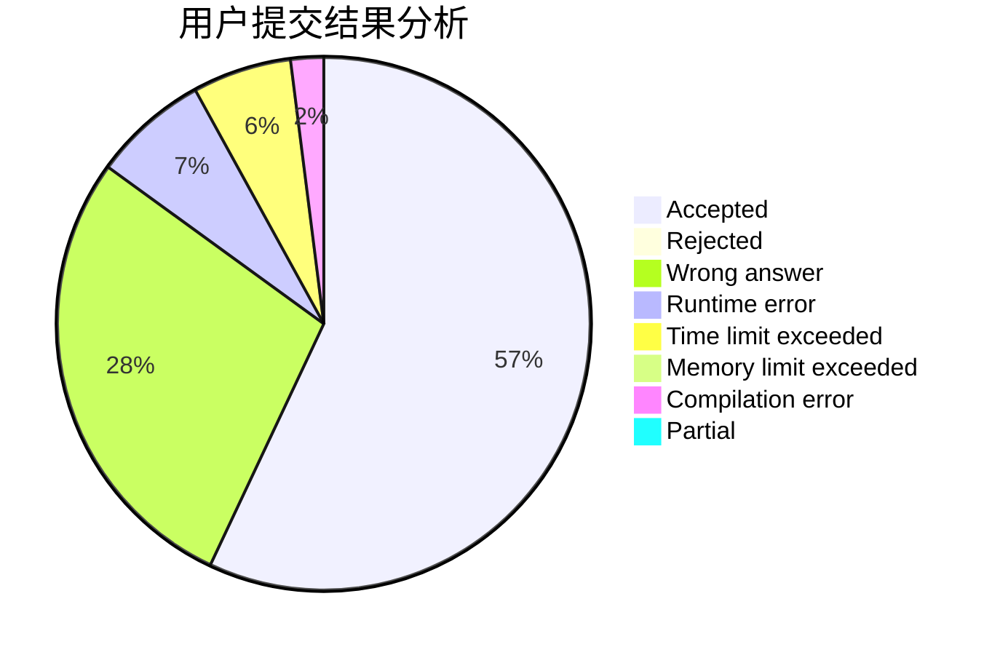
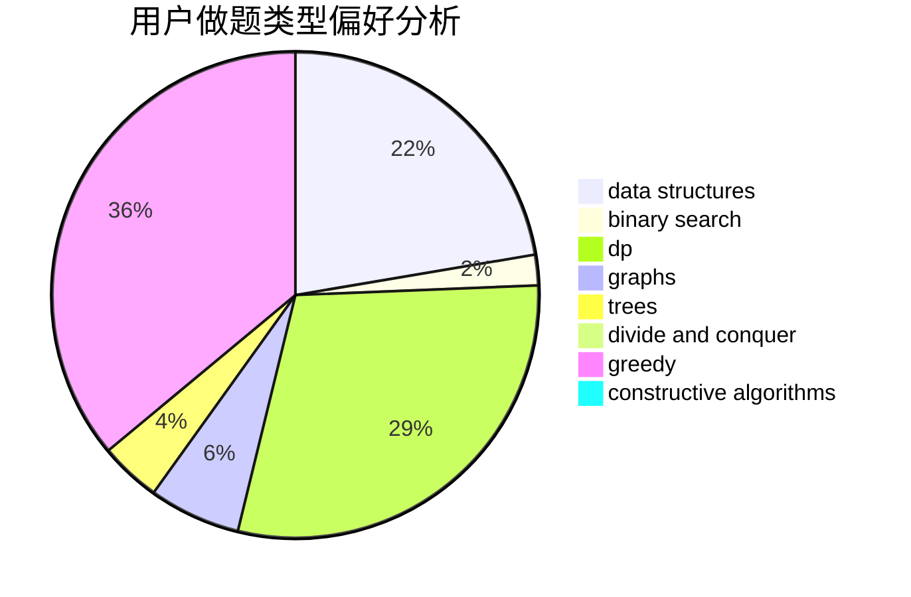
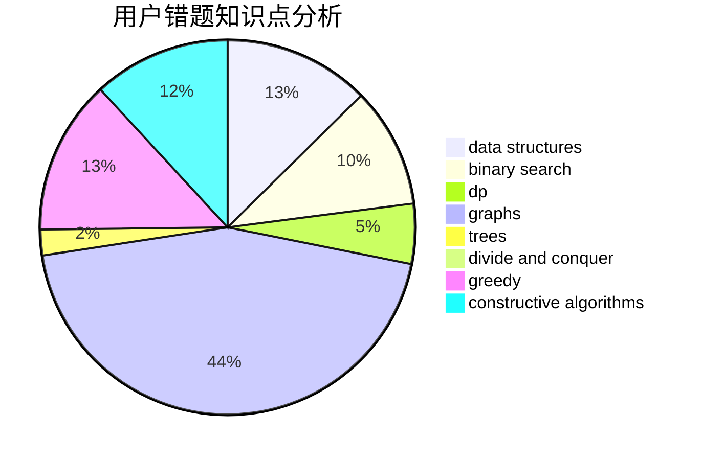

# dengyaotriangle

<!-- tabs:start -->

#### **用户提交结果分析**

#### **用户做题类型偏好分析**

#### **用户错题知识点分析**

<!-- tabs:end -->
# 推荐题目
[1106B](https://codeforces.com/contest/1106/problem/B)		data structures,
                        implementation		  
[985A](https://codeforces.com/contest/985/problem/A)		implementation		  
[1473G](https://codeforces.com/contest/1473/problem/G)		combinatorics,
                        dp,
                        fft,
                        math		  
[660C](https://codeforces.com/contest/660/problem/C)		binary search,
                        dp,
                        two pointers		  
[527B](https://codeforces.com/contest/527/problem/B)		greedy		  
[645F](https://codeforces.com/contest/645/problem/F)		combinatorics,
                        math,
                        number theory		  
[1152E](https://codeforces.com/contest/1152/problem/E)		constructive algorithms,
                        dfs and similar,
                        graphs		  
[868B](https://codeforces.com/contest/868/problem/B)		implementation		  
[938E](https://codeforces.com/contest/938/problem/E)		combinatorics,
                        math		  
[281A](https://codeforces.com/contest/281/problem/A)		implementation,
                        strings		  
