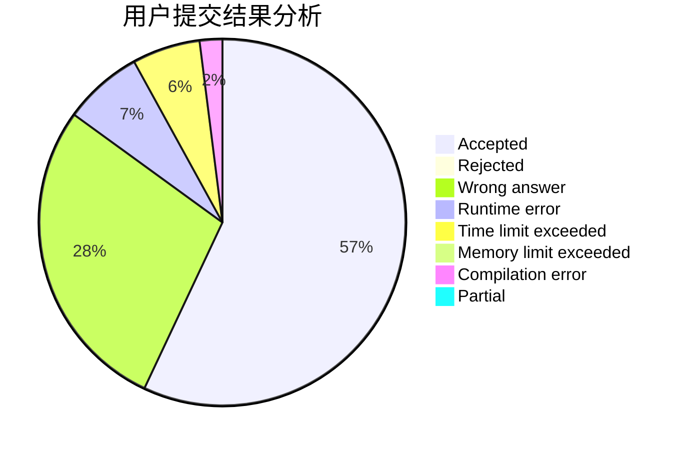
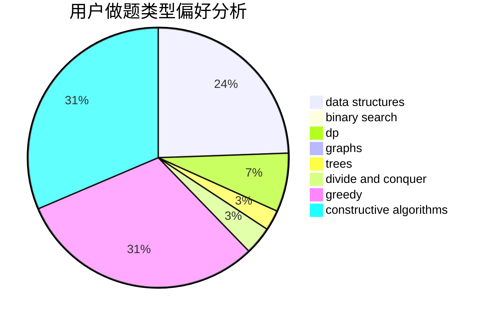
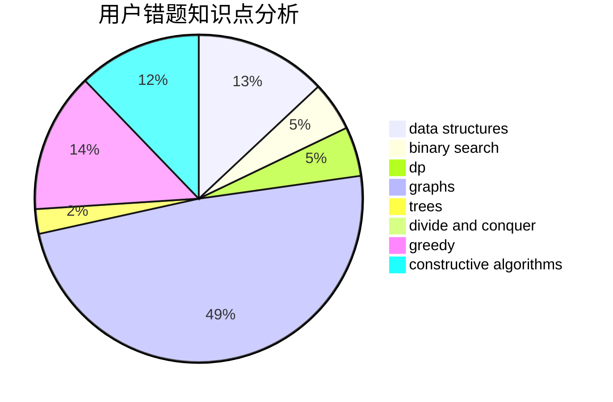

# dengyaotriangle

<!-- tabs:start -->

#### **用户提交结果分析**

#### **用户做题类型偏好分析**

#### **用户错题知识点分析**

<!-- tabs:end -->
# 推荐题目
[1106E](https://codeforces.com/contest/1106/problem/E)		data structures,
                        dp		  
[9A](https://codeforces.com/contest/9/problem/A)		math,
                        probabilities		  
[1482D](https://codeforces.com/contest/1482/problem/D)		data structures,
                        dsu,
                        implementation,
                        shortest paths		  
[681A](https://codeforces.com/contest/681/problem/A)		implementation		  
[551B](https://codeforces.com/contest/551/problem/B)		brute force,
                        constructive algorithms,
                        implementation,
                        strings		  
[672B](https://codeforces.com/contest/672/problem/B)		constructive algorithms,
                        implementation,
                        strings		  
[1154E](https://codeforces.com/contest/1154/problem/E)		data structures,
                        implementation,
                        sortings		  
[887D](https://codeforces.com/contest/887/problem/D)		data structures,
                        two pointers		  
[960A](https://codeforces.com/contest/960/problem/A)		implementation		  
[297C](https://codeforces.com/contest/297/problem/C)		constructive algorithms		  
