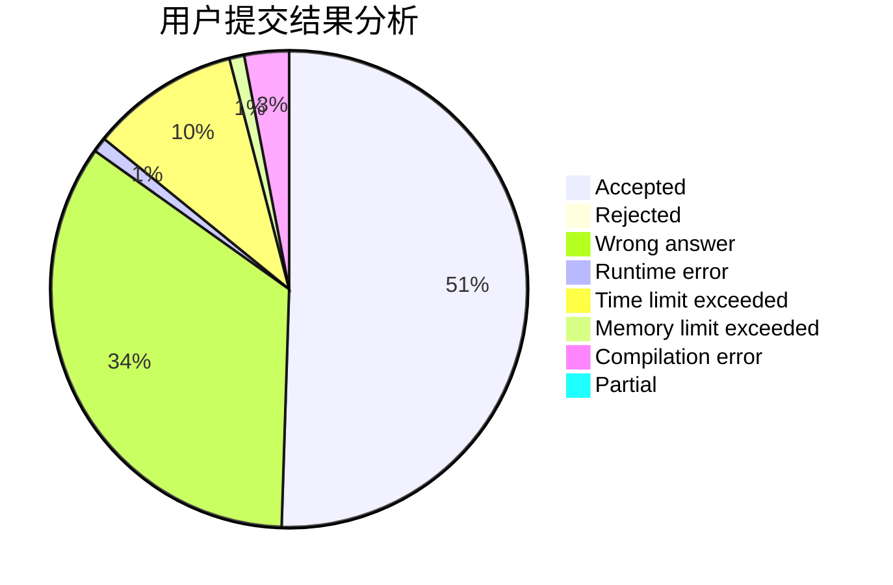
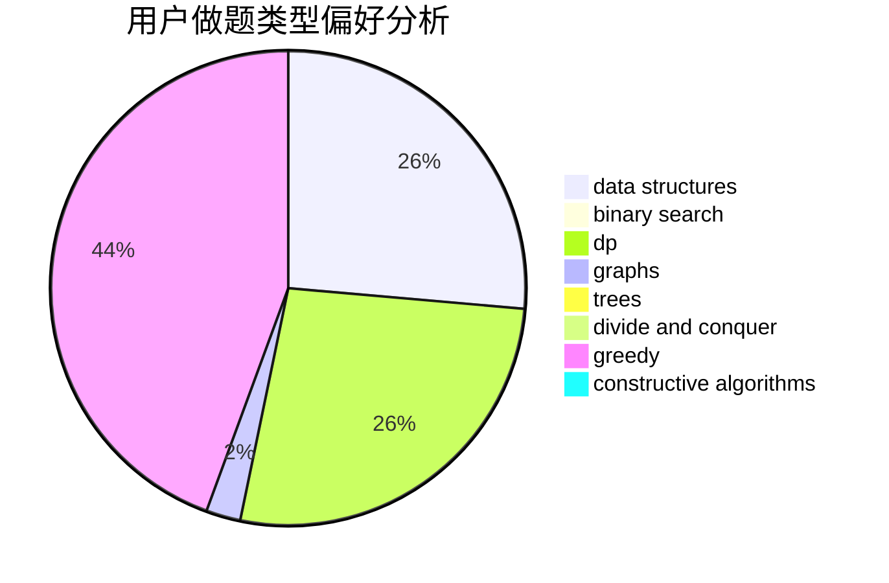

# dengyipeng

<!-- tabs:start -->

#### **用户提交结果分析**

#### **用户做题类型偏好分析**

#### **用户错题知识点分析**

<!-- tabs:end -->
# 推荐题目
[1070D](https://codeforces.com/contest/1070/problem/D)		greedy		  
[899D](https://codeforces.com/contest/899/problem/D)		constructive algorithms,
                        math		  
[600C](https://codeforces.com/contest/600/problem/C)		constructive algorithms,
                        greedy,
                        strings		  
[269D](https://codeforces.com/contest/269/problem/D)		data structures,
                        dp,
                        graphs,
                        sortings		  
[981G](https://codeforces.com/contest/981/problem/G)		data structures		  
[258A](https://codeforces.com/contest/258/problem/A)		greedy,
                        math		  
[11411](https://codeforces.com/contest/1141/problem/1)		dsu,graphs,sortings,trees		  
[448D](https://codeforces.com/contest/448/problem/D)		binary search,
                        brute force		  
[1360E](https://codeforces.com/contest/1360/problem/E)		dp,
                        graphs,
                        implementation,
                        shortest paths		  
[13352](https://codeforces.com/contest/1335/problem/2)		dsu,graphs,sortings,trees		  
