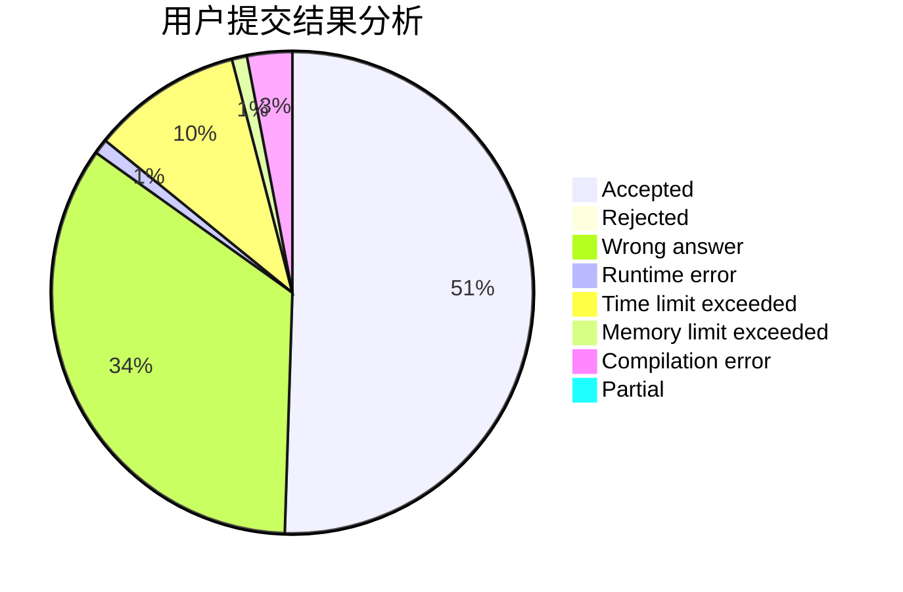
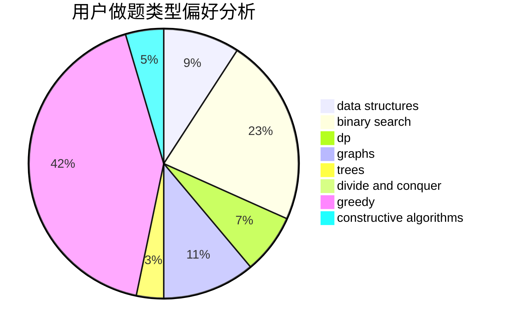

# dengyipeng

<!-- tabs:start -->

#### **用户提交结果分析**

#### **用户做题类型偏好分析**

#### **用户错题知识点分析**

<!-- tabs:end -->
# 推荐题目
[1070A](https://codeforces.com/contest/1070/problem/A)		dp,
                        graphs,
                        number theory,
                        shortest paths		  
[878E](https://codeforces.com/contest/878/problem/E)		combinatorics,
                        dp		  
[580A](https://codeforces.com/contest/580/problem/A)		brute force,
                        dp,
                        implementation		  
[251B](https://codeforces.com/contest/251/problem/B)		implementation,
                        math		  
[95E](https://codeforces.com/contest/95/problem/E)		dp,
                        dsu,
                        graphs		  
[235B](https://codeforces.com/contest/235/problem/B)		dp,
                        math,
                        probabilities		  
[1139D](https://codeforces.com/contest/1139/problem/D)		dp,
                        math,
                        number theory,
                        probabilities		  
[425B](https://codeforces.com/contest/425/problem/B)		bitmasks,
                        greedy		  
[1354A](https://codeforces.com/contest/1354/problem/A)		math		  
[1328F](https://codeforces.com/contest/1328/problem/F)		greedy		  
