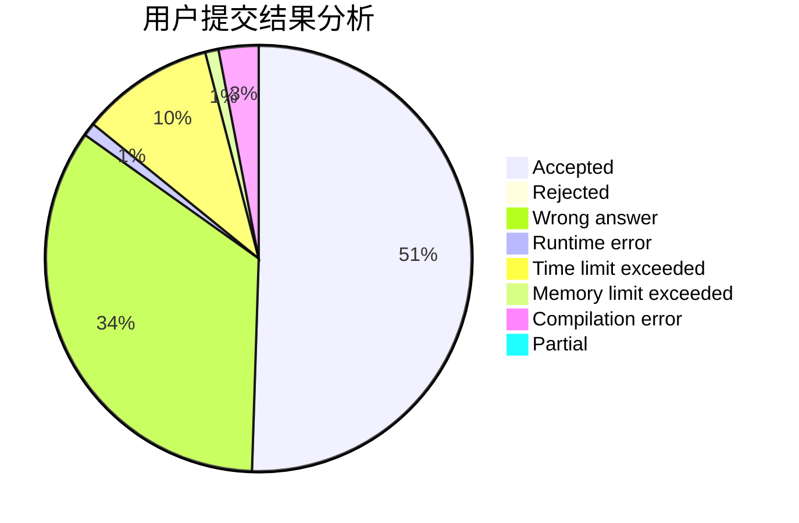
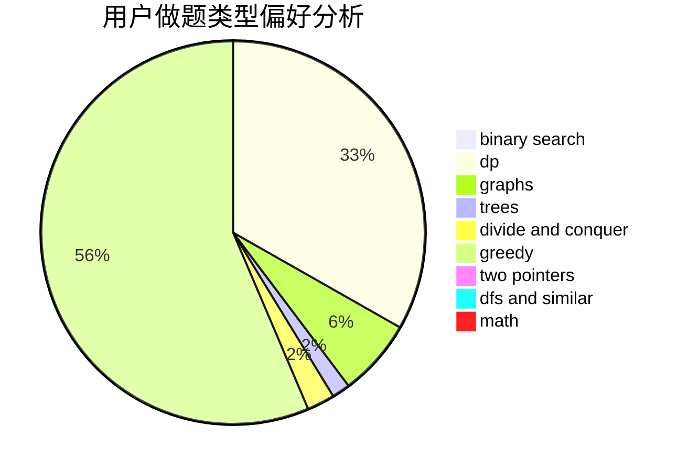

# dengyipeng

<!-- tabs:start -->

#### **用户提交结果分析**

#### **用户做题类型偏好分析**

<!-- tabs:end -->
# 推荐题目
[1070D](https://codeforces.com/contest/1070/problem/D)
[899D](https://codeforces.com/contest/899/problem/D)
[600C](https://codeforces.com/contest/600/problem/C)
[269D](https://codeforces.com/contest/269/problem/D)
[981G](https://codeforces.com/contest/981/problem/G)
[258A](https://codeforces.com/contest/258/problem/A)
[11411](https://codeforces.com/contest/1141/problem/1)
[448D](https://codeforces.com/contest/448/problem/D)
[1360E](https://codeforces.com/contest/1360/problem/E)
[13352](https://codeforces.com/contest/1335/problem/2)
