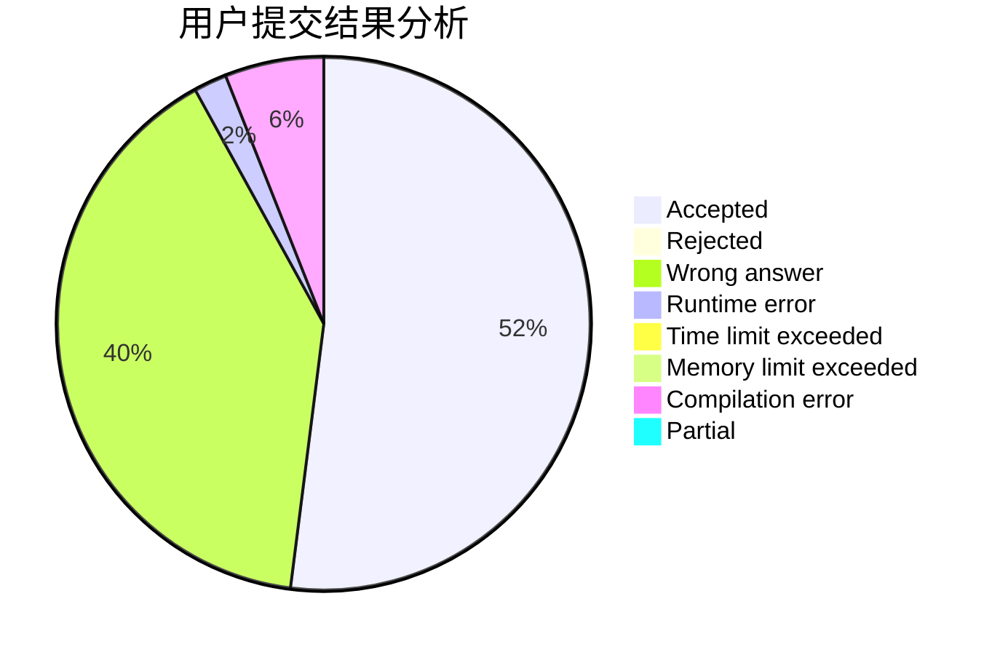
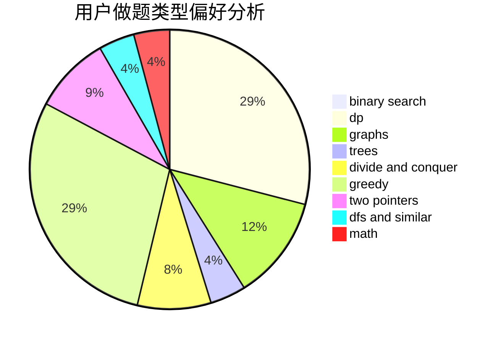

# deque

<!-- tabs:start -->

#### **用户提交结果分析**

#### **用户做题类型偏好分析**

<!-- tabs:end -->
# 推荐题目
[1223A](https://codeforces.com/contest/1223/problem/A)
[883M](https://codeforces.com/contest/883/problem/M)
[1385G](https://codeforces.com/contest/1385/problem/G)
[319D](https://codeforces.com/contest/319/problem/D)
[1090D](https://codeforces.com/contest/1090/problem/D)
[73B](https://codeforces.com/contest/73/problem/B)
[300B](https://codeforces.com/contest/300/problem/B)
[1019A](https://codeforces.com/contest/1019/problem/A)
[691E](https://codeforces.com/contest/691/problem/E)
[868A](https://codeforces.com/contest/868/problem/A)
