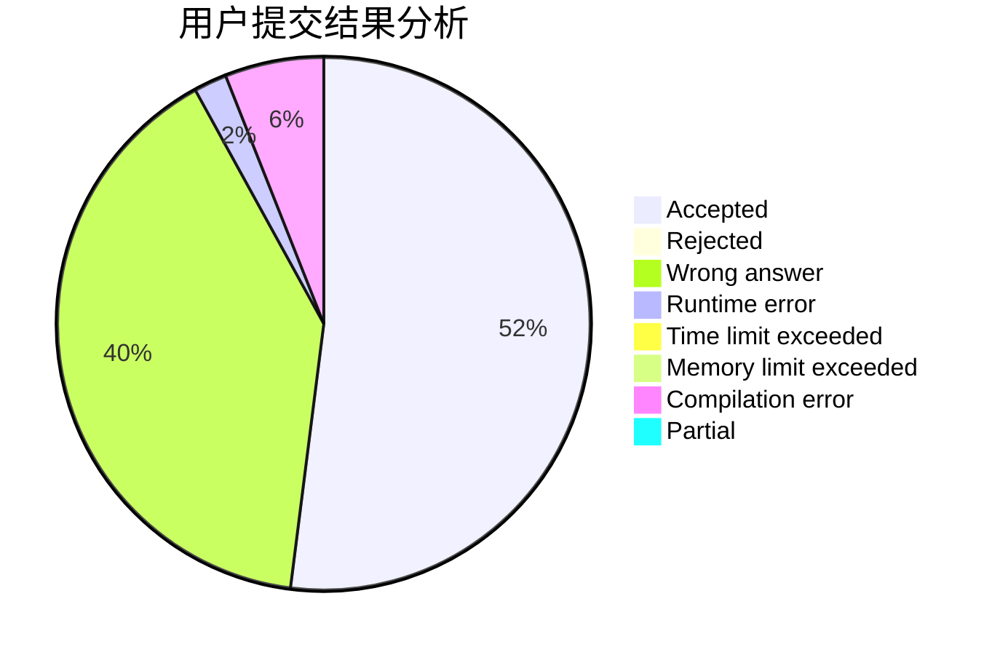
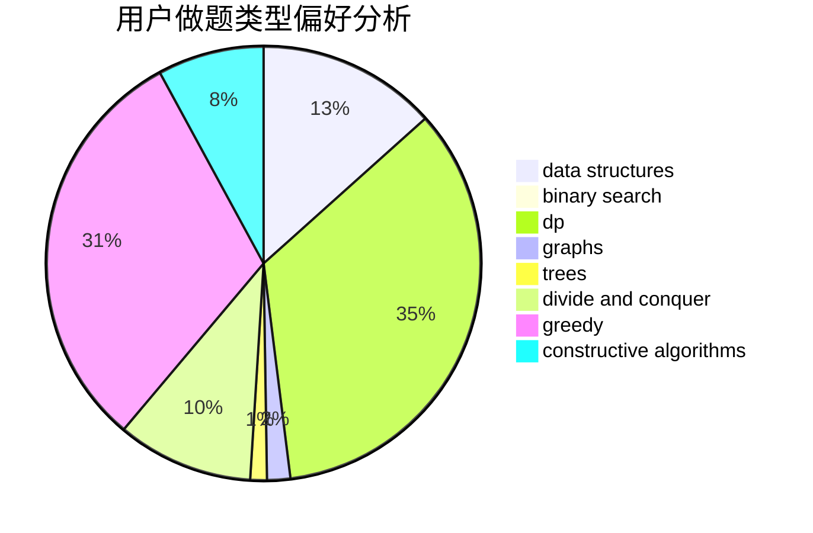
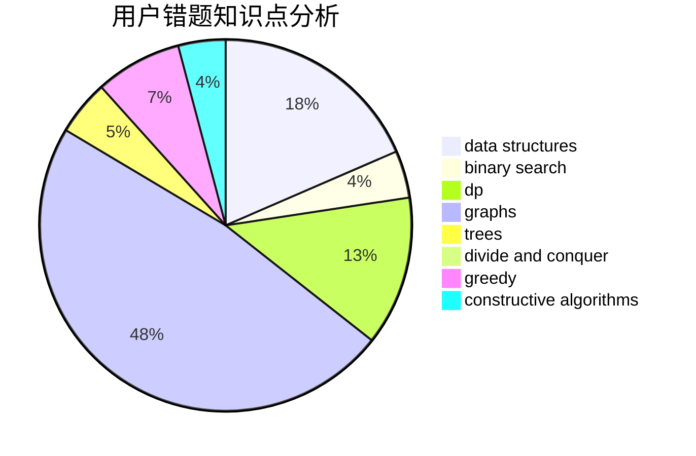

# deque

<!-- tabs:start -->

#### **用户提交结果分析**

#### **用户做题类型偏好分析**

#### **用户错题知识点分析**

<!-- tabs:end -->
# 推荐题目
[1223A](https://codeforces.com/contest/1223/problem/A)		math		  
[883M](https://codeforces.com/contest/883/problem/M)		greedy,
                        math		  
[1385G](https://codeforces.com/contest/1385/problem/G)		2-sat,
                        dfs and similar,
                        dsu,
                        graphs,
                        implementation		  
[319D](https://codeforces.com/contest/319/problem/D)		greedy,
                        hashing,
                        string suffix structures,
                        strings		  
[1090D](https://codeforces.com/contest/1090/problem/D)		constructive algorithms		  
[73B](https://codeforces.com/contest/73/problem/B)		binary search,
                        greedy,
                        sortings		  
[300B](https://codeforces.com/contest/300/problem/B)		brute force,
                        dfs and similar,
                        graphs		  
[1019A](https://codeforces.com/contest/1019/problem/A)		brute force,
                        greedy		  
[691E](https://codeforces.com/contest/691/problem/E)		matrices		  
[868A](https://codeforces.com/contest/868/problem/A)		brute force,
                        implementation,
                        strings		  
