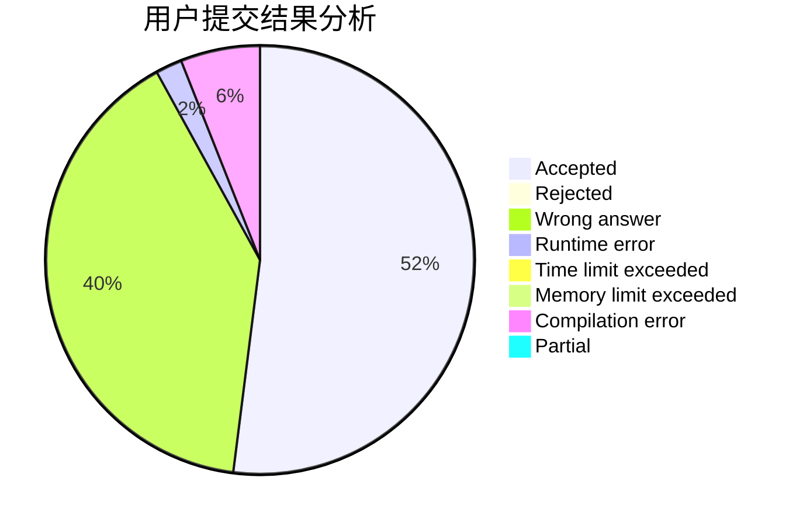
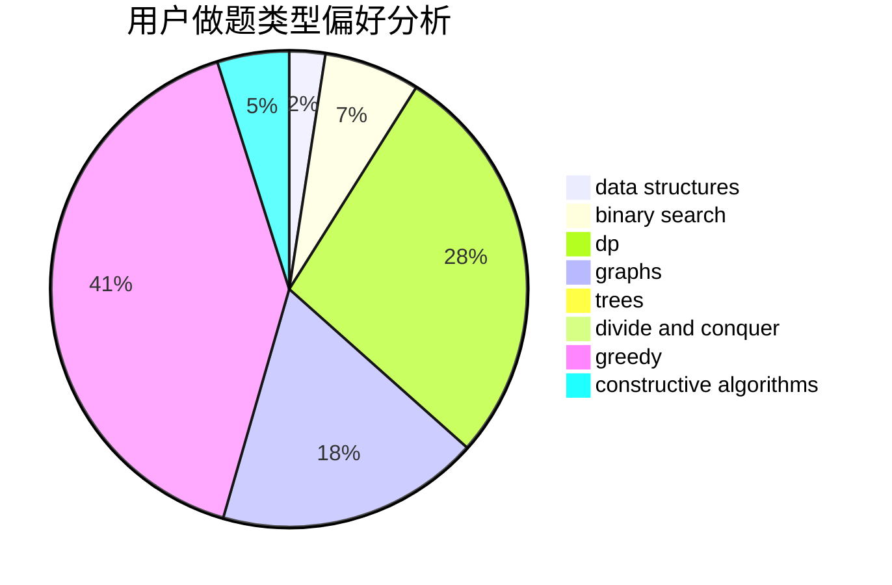
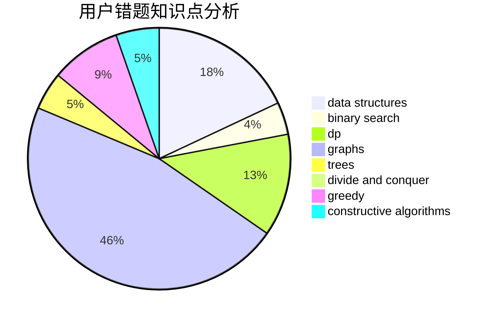

# deque

<!-- tabs:start -->

#### **用户提交结果分析**

#### **用户做题类型偏好分析**

#### **用户错题知识点分析**

<!-- tabs:end -->
# 推荐题目
[1216D](https://codeforces.com/contest/1216/problem/D)		math		  
[864C](https://codeforces.com/contest/864/problem/C)		greedy,
                        implementation,
                        math		  
[1376B3](https://codeforces.com/contest/1376B/problem/3)		dsu,graphs,sortings,trees		  
[301A](https://codeforces.com/contest/301/problem/A)		constructive algorithms		  
[108C](https://codeforces.com/contest/108/problem/C)		dsu,graphs,sortings,trees		  
[722F](https://codeforces.com/contest/722/problem/F)		chinese remainder theorem,
                        data structures,
                        implementation,
                        number theory,
                        two pointers		  
[286A](https://codeforces.com/contest/286/problem/A)		constructive algorithms,
                        math		  
[1017E](https://codeforces.com/contest/1017/problem/E)		geometry,
                        hashing,
                        strings		  
[670A](https://codeforces.com/contest/670/problem/A)		brute force,
                        constructive algorithms,
                        greedy,
                        math		  
[848D](https://codeforces.com/contest/848/problem/D)		combinatorics,
                        dp,
                        flows,
                        graphs		  
