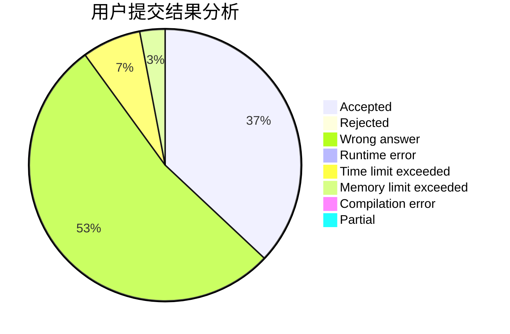
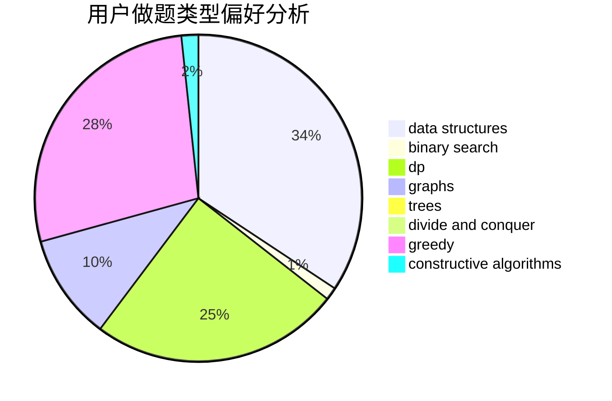
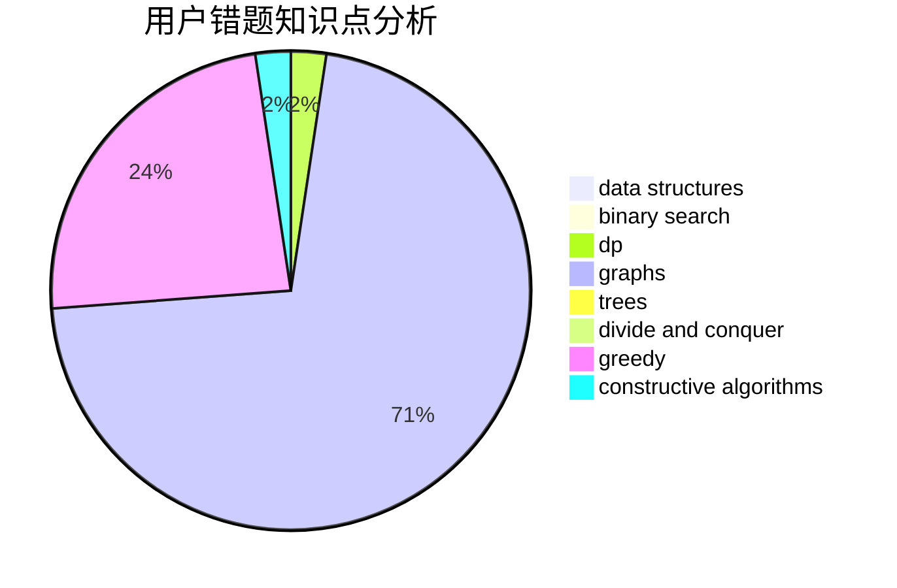

# detect

<!-- tabs:start -->

#### **用户提交结果分析**

#### **用户做题类型偏好分析**

#### **用户错题知识点分析**

<!-- tabs:end -->
# 推荐题目
[585F](https://codeforces.com/contest/585/problem/F)		dp,
                        implementation,
                        strings		  
[653C](https://codeforces.com/contest/653/problem/C)		brute force,
                        implementation		  
[825F](https://codeforces.com/contest/825/problem/F)		dp,
                        hashing,
                        string suffix structures,
                        strings		  
[1358F](https://codeforces.com/contest/1358/problem/F)		binary search,
                        constructive algorithms,
                        greedy,
                        implementation		  
[628C](https://codeforces.com/contest/628/problem/C)		greedy,
                        strings		  
[1070F](https://codeforces.com/contest/1070/problem/F)		greedy		  
[1031C](https://codeforces.com/contest/1031/problem/C)		greedy		  
[320B](https://codeforces.com/contest/320/problem/B)		dfs and similar,
                        graphs		  
[1361E](https://codeforces.com/contest/1361/problem/E)		dfs and similar,
                        graphs,
                        probabilities,
                        trees		  
[852D](https://codeforces.com/contest/852/problem/D)		binary search,
                        flows,
                        graph matchings,
                        shortest paths		  
