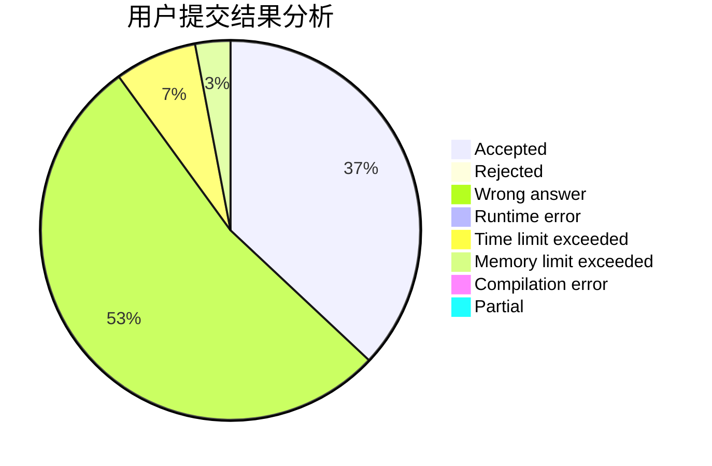
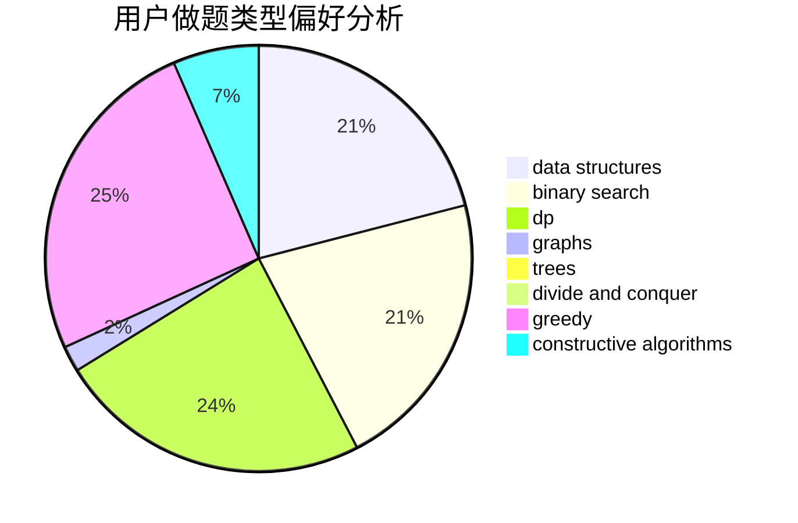
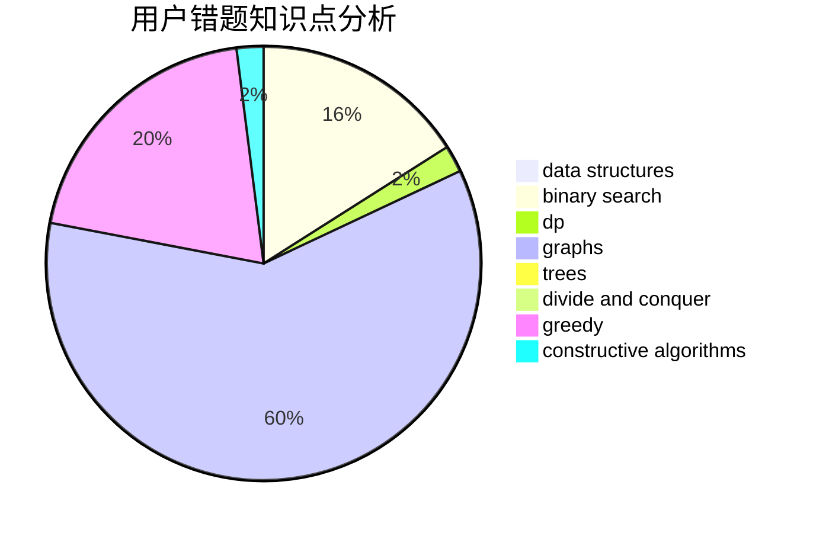

# detect

<!-- tabs:start -->

#### **用户提交结果分析**

#### **用户做题类型偏好分析**

#### **用户错题知识点分析**

<!-- tabs:end -->
# 推荐题目
[567A](https://codeforces.com/contest/567/problem/A)		greedy,
                        implementation		  
[627C](https://codeforces.com/contest/627/problem/C)		data structures,
                        divide and conquer,
                        greedy		  
[808G](https://codeforces.com/contest/808/problem/G)		dp,
                        strings		  
[1352B](https://codeforces.com/contest/1352/problem/B)		constructive algorithms,
                        math		  
[609C](https://codeforces.com/contest/609/problem/C)		implementation,
                        math		  
[1070C](https://codeforces.com/contest/1070/problem/C)		data structures,
                        greedy		  
[1030G](https://codeforces.com/contest/1030/problem/G)		number theory		  
[301D](https://codeforces.com/contest/301/problem/D)		data structures		  
[1355A](https://codeforces.com/contest/1355/problem/A)		brute force,
                        implementation,
                        math		  
[834C](https://codeforces.com/contest/834/problem/C)		dsu,graphs,sortings,trees		  
