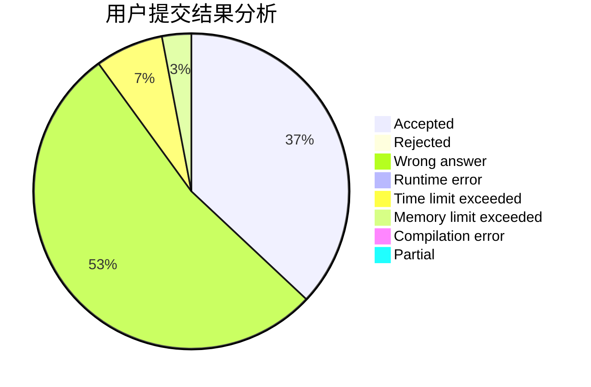
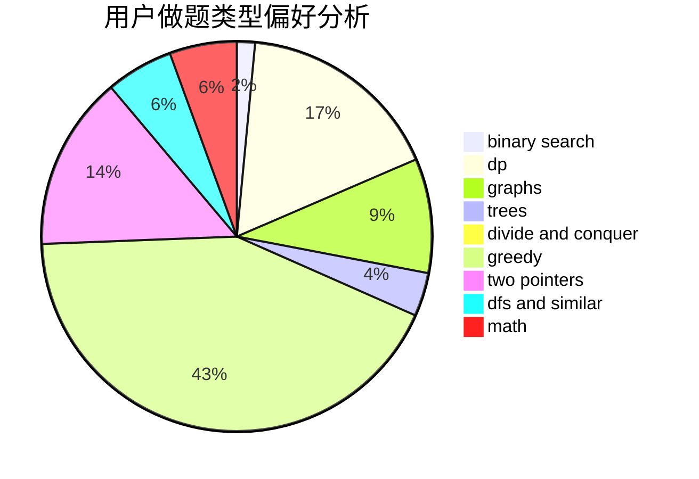

# detect

<!-- tabs:start -->

#### **用户提交结果分析**

#### **用户做题类型偏好分析**

<!-- tabs:end -->
# 推荐题目
[585F](https://codeforces.com/contest/585/problem/F)
[653C](https://codeforces.com/contest/653/problem/C)
[825F](https://codeforces.com/contest/825/problem/F)
[1358F](https://codeforces.com/contest/1358/problem/F)
[628C](https://codeforces.com/contest/628/problem/C)
[1070F](https://codeforces.com/contest/1070/problem/F)
[1031C](https://codeforces.com/contest/1031/problem/C)
[320B](https://codeforces.com/contest/320/problem/B)
[1361E](https://codeforces.com/contest/1361/problem/E)
[852D](https://codeforces.com/contest/852/problem/D)
