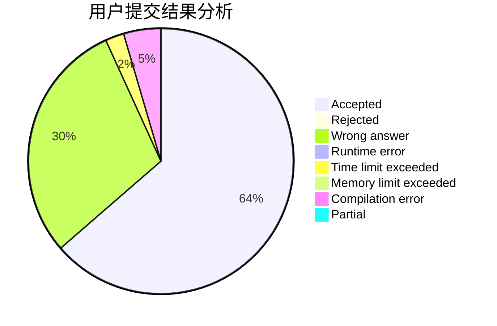
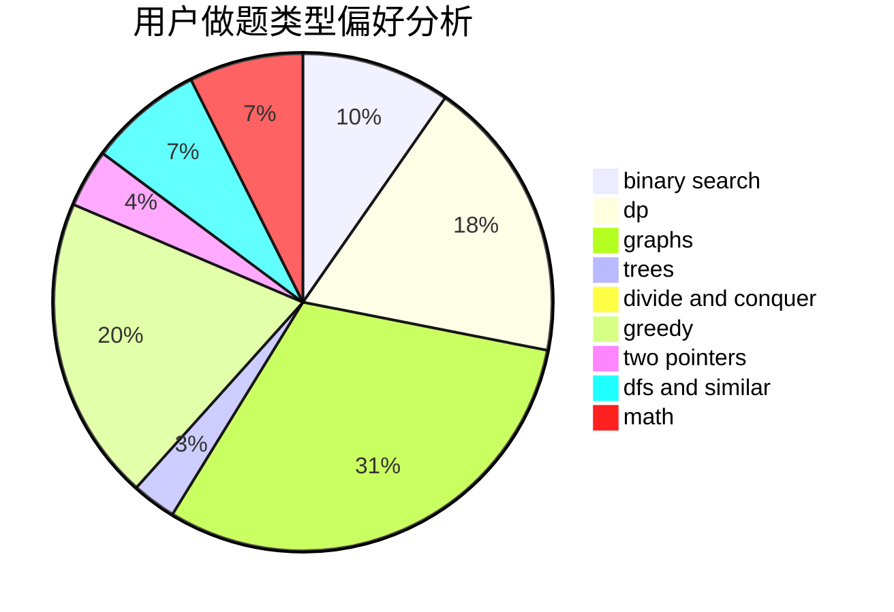

# devoted_love

<!-- tabs:start -->

#### **用户提交结果分析**

#### **用户做题类型偏好分析**

<!-- tabs:end -->
# 推荐题目
[363B](https://codeforces.com/contest/363/problem/B)
[732A](https://codeforces.com/contest/732/problem/A)
[805D](https://codeforces.com/contest/805/problem/D)
[965B](https://codeforces.com/contest/965/problem/B)
[346A](https://codeforces.com/contest/346/problem/A)
[1137F](https://codeforces.com/contest/1137/problem/F)
[1278A](https://codeforces.com/contest/1278/problem/A)
[1234F](https://codeforces.com/contest/1234/problem/F)
[63C](https://codeforces.com/contest/63/problem/C)
[707D](https://codeforces.com/contest/707/problem/D)
