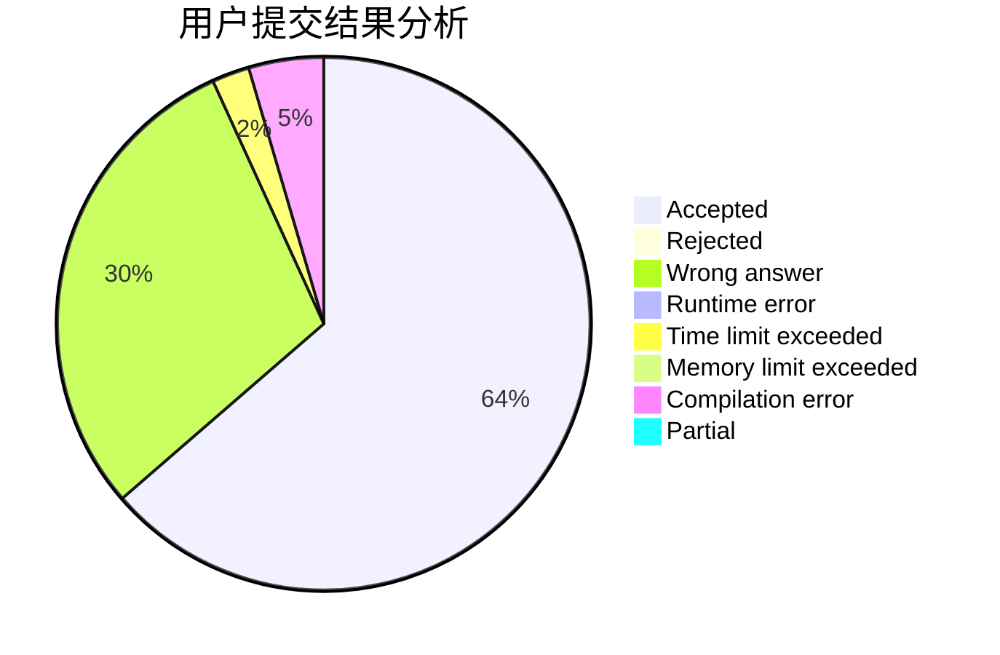
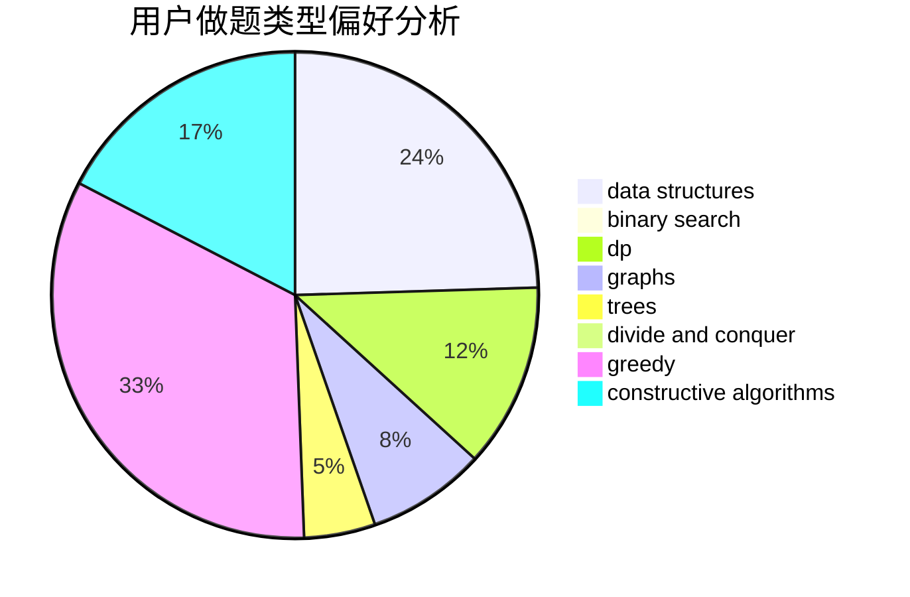
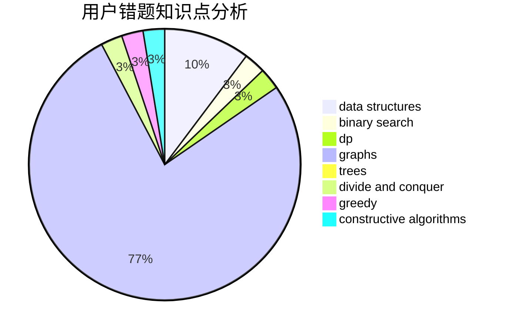

# devoted_love

<!-- tabs:start -->

#### **用户提交结果分析**

#### **用户做题类型偏好分析**

#### **用户错题知识点分析**

<!-- tabs:end -->
# 推荐题目
[363B](https://codeforces.com/contest/363/problem/B)		brute force,
                        dp		  
[732A](https://codeforces.com/contest/732/problem/A)		brute force,
                        constructive algorithms,
                        implementation,
                        math		  
[805D](https://codeforces.com/contest/805/problem/D)		dsu,graphs,sortings,trees		  
[965B](https://codeforces.com/contest/965/problem/B)		implementation		  
[346A](https://codeforces.com/contest/346/problem/A)		games,
                        math,
                        number theory		  
[1137F](https://codeforces.com/contest/1137/problem/F)		data structures,
                        trees		  
[1278A](https://codeforces.com/contest/1278/problem/A)		brute force,
                        implementation,
                        strings		  
[1234F](https://codeforces.com/contest/1234/problem/F)		bitmasks,
                        dp		  
[63C](https://codeforces.com/contest/63/problem/C)		brute force,
                        implementation		  
[707D](https://codeforces.com/contest/707/problem/D)		bitmasks,
                        data structures,
                        dfs and similar,
                        implementation		  
