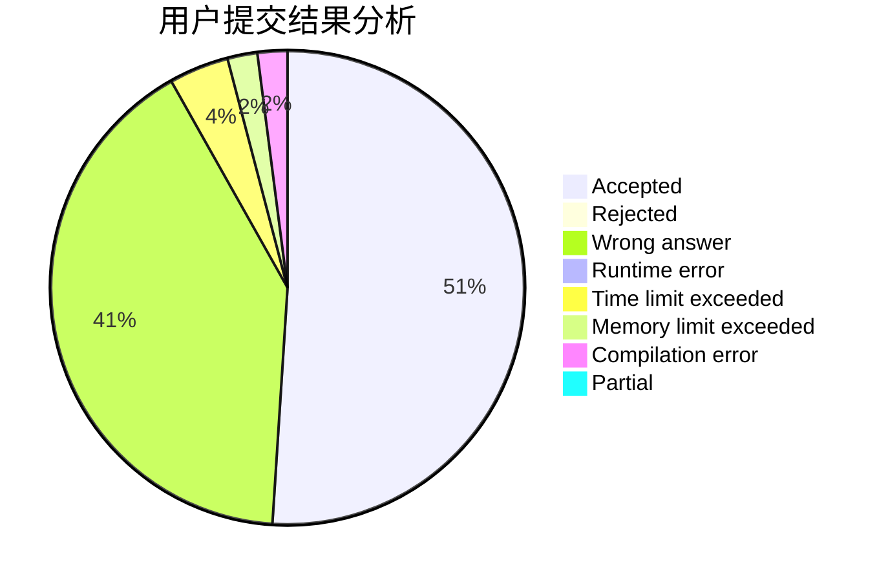
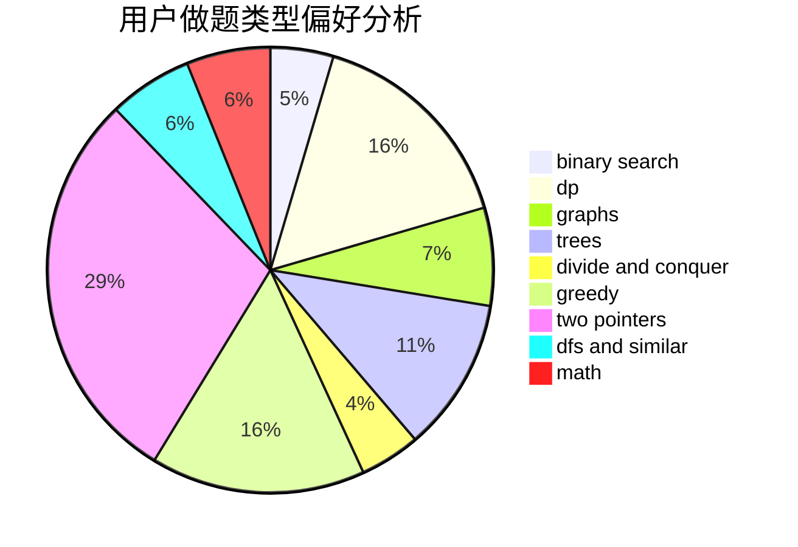

# dfcmd

<!-- tabs:start -->

#### **用户提交结果分析**

#### **用户做题类型偏好分析**

<!-- tabs:end -->
# 推荐题目
[627E](https://codeforces.com/contest/627/problem/E)
[788D](https://codeforces.com/contest/788/problem/D)
[136C](https://codeforces.com/contest/136/problem/C)
[490B](https://codeforces.com/contest/490/problem/B)
[266E](https://codeforces.com/contest/266/problem/E)
[299C](https://codeforces.com/contest/299/problem/C)
[1183C](https://codeforces.com/contest/1183/problem/C)
[18E](https://codeforces.com/contest/18/problem/E)
[107A](https://codeforces.com/contest/107/problem/A)
[418B](https://codeforces.com/contest/418/problem/B)
