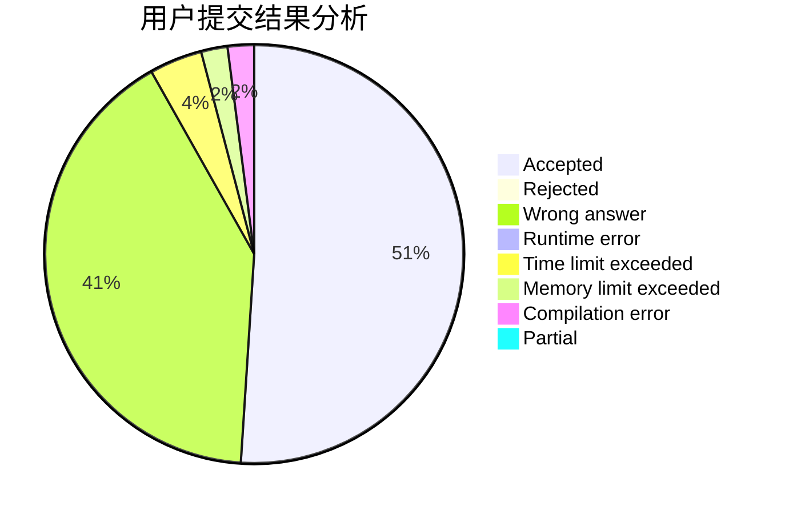
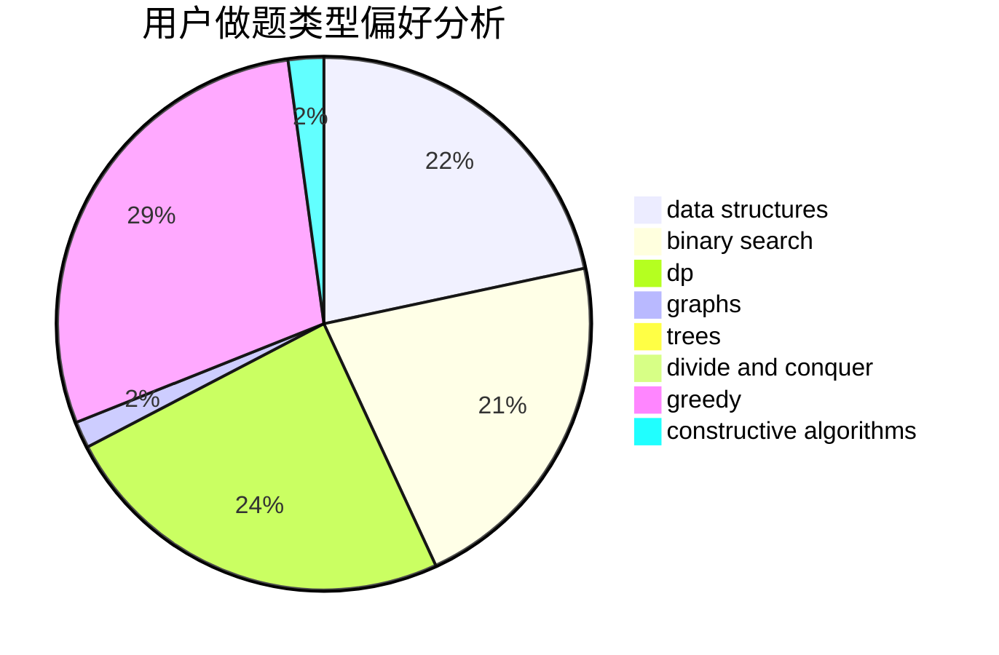
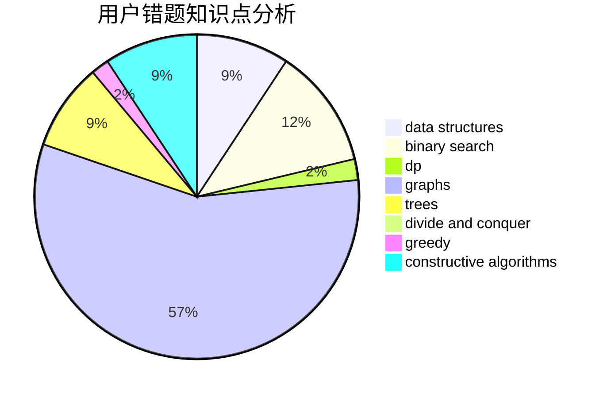

# dfcmd

<!-- tabs:start -->

#### **用户提交结果分析**

#### **用户做题类型偏好分析**

#### **用户错题知识点分析**

<!-- tabs:end -->
# 推荐题目
[608D](https://codeforces.com/contest/608/problem/D)		dsu,graphs,sortings,trees		  
[768E](https://codeforces.com/contest/768/problem/E)		bitmasks,
                        dp,
                        games		  
[1362D](https://codeforces.com/contest/1362/problem/D)		dsu,graphs,sortings,trees		  
[472A](https://codeforces.com/contest/472/problem/A)		math,
                        number theory		  
[246C](https://codeforces.com/contest/246/problem/C)		brute force,
                        constructive algorithms,
                        greedy		  
[282E](https://codeforces.com/contest/282/problem/E)		bitmasks,
                        data structures,
                        trees		  
[1180B](https://codeforces.com/contest/1180/problem/B)		greedy,
                        implementation		  
[165C](https://codeforces.com/contest/165/problem/C)		binary search,
                        brute force,
                        dp,
                        math,
                        strings,
                        two pointers		  
[1079B](https://codeforces.com/contest/1079/problem/B)		dsu,graphs,sortings,trees		  
[388E](https://codeforces.com/contest/388/problem/E)		geometry		  
