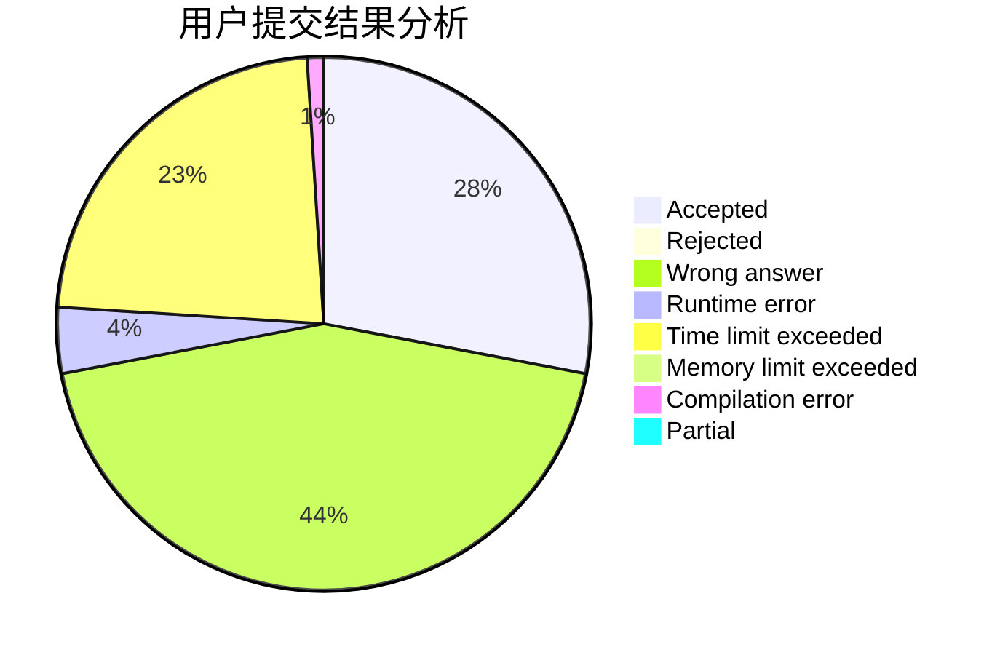
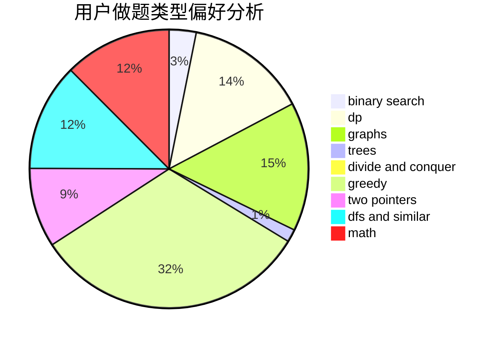

# dhxh

<!-- tabs:start -->

#### **用户提交结果分析**

#### **用户做题类型偏好分析**

<!-- tabs:end -->
# 推荐题目
[1200D](https://codeforces.com/contest/1200/problem/D)
[485A](https://codeforces.com/contest/485/problem/A)
[1044D](https://codeforces.com/contest/1044/problem/D)
[916D](https://codeforces.com/contest/916/problem/D)
[519E](https://codeforces.com/contest/519/problem/E)
[1335B](https://codeforces.com/contest/1335/problem/B)
[898D](https://codeforces.com/contest/898/problem/D)
[418D](https://codeforces.com/contest/418/problem/D)
[1104E](https://codeforces.com/contest/1104/problem/E)
[809C](https://codeforces.com/contest/809/problem/C)
