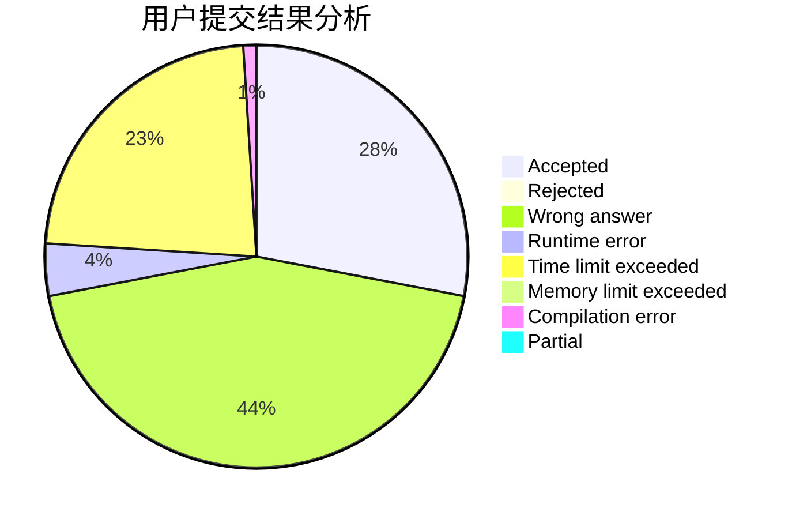
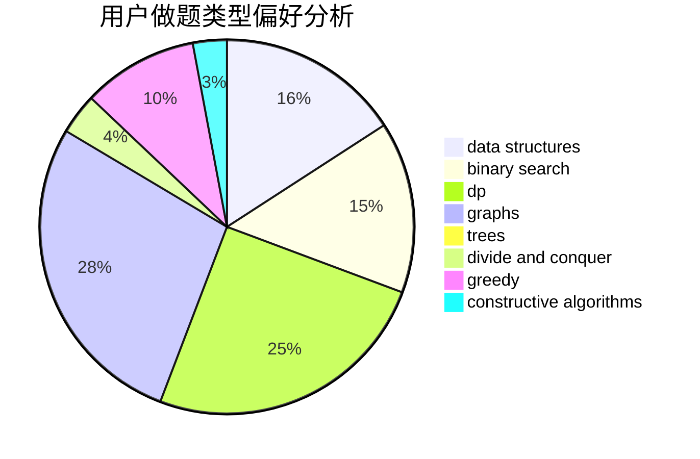
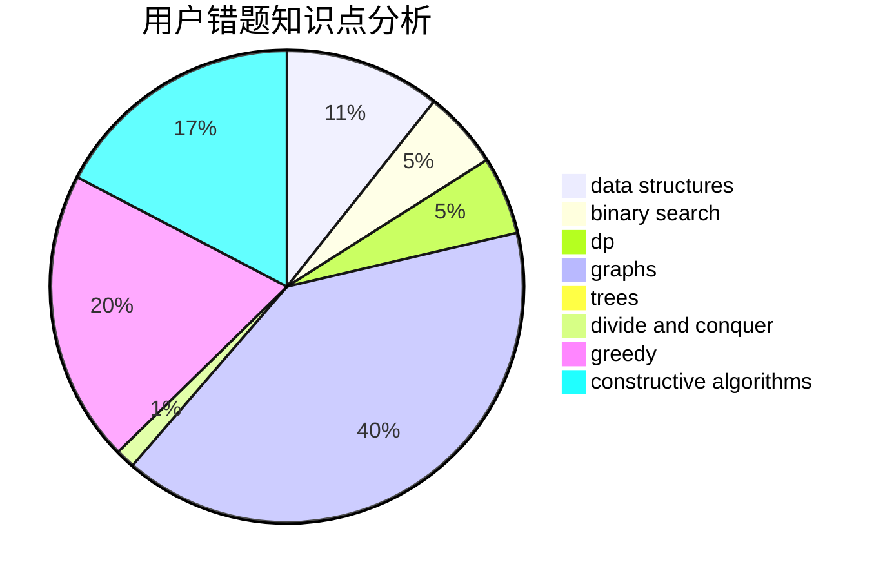

# dhxh

<!-- tabs:start -->

#### **用户提交结果分析**

#### **用户做题类型偏好分析**

#### **用户错题知识点分析**

<!-- tabs:end -->
# 推荐题目
[1197B](https://codeforces.com/contest/1197/problem/B)		greedy,
                        implementation		  
[466A](https://codeforces.com/contest/466/problem/A)		implementation		  
[1043G](https://codeforces.com/contest/1043/problem/G)		data structures,
                        divide and conquer,
                        hashing,
                        string suffix structures,
                        strings		  
[900A](https://codeforces.com/contest/900/problem/A)		geometry,
                        implementation		  
[498E](https://codeforces.com/contest/498/problem/E)		dp,
                        matrices		  
[1329B](https://codeforces.com/contest/1329/problem/B)		bitmasks,
                        combinatorics,
                        math		  
[877E](https://codeforces.com/contest/877/problem/E)		bitmasks,
                        data structures,
                        trees		  
[389B](https://codeforces.com/contest/389/problem/B)		greedy,
                        implementation		  
[1104B](https://codeforces.com/contest/1104/problem/B)		data structures,
                        implementation,
                        math		  
[794B](https://codeforces.com/contest/794/problem/B)		geometry,
                        math		  
