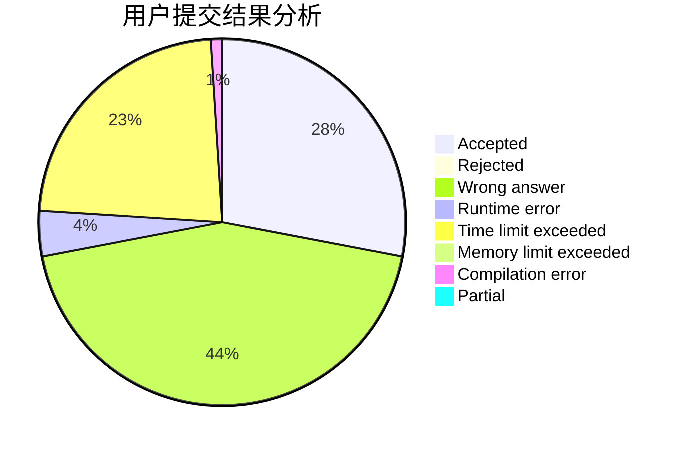
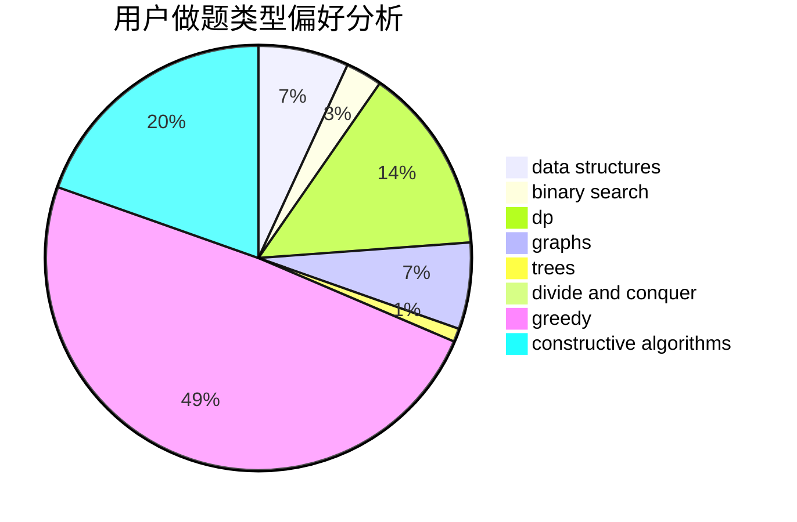
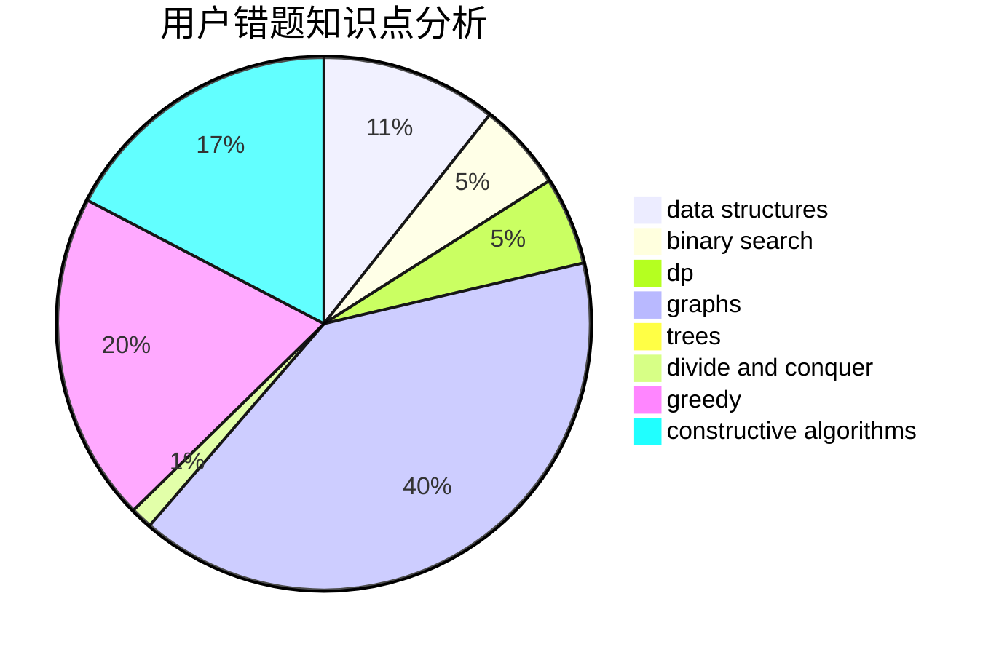

# dhxh

<!-- tabs:start -->

#### **用户提交结果分析**

#### **用户做题类型偏好分析**

#### **用户错题知识点分析**

<!-- tabs:end -->
# 推荐题目
[1200D](https://codeforces.com/contest/1200/problem/D)		brute force,
                        data structures,
                        dp,
                        implementation,
                        two pointers		  
[485A](https://codeforces.com/contest/485/problem/A)		implementation,
                        math,
                        matrices		  
[1044D](https://codeforces.com/contest/1044/problem/D)		data structures,
                        dsu		  
[916D](https://codeforces.com/contest/916/problem/D)		data structures,
                        interactive,
                        trees		  
[519E](https://codeforces.com/contest/519/problem/E)		binary search,
                        data structures,
                        dfs and similar,
                        dp,
                        trees		  
[1335B](https://codeforces.com/contest/1335/problem/B)		constructive algorithms		  
[898D](https://codeforces.com/contest/898/problem/D)		greedy		  
[418D](https://codeforces.com/contest/418/problem/D)		data structures,
                        graphs,
                        trees		  
[1104E](https://codeforces.com/contest/1104/problem/E)		dsu,graphs,sortings,trees		  
[809C](https://codeforces.com/contest/809/problem/C)		combinatorics,
                        divide and conquer,
                        dp		  
