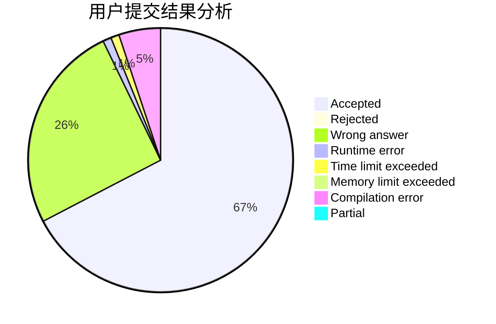
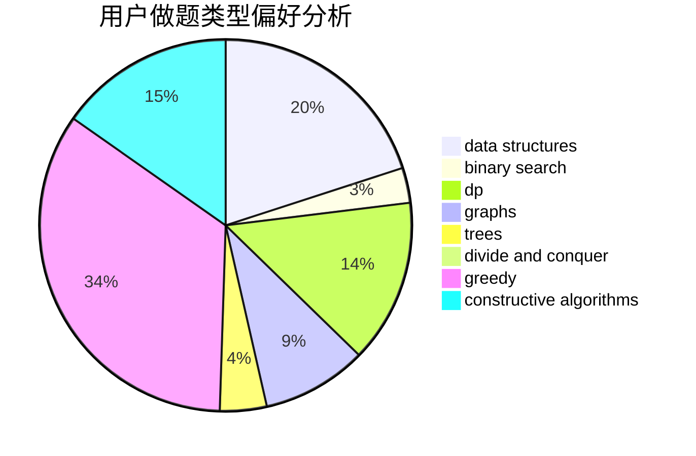
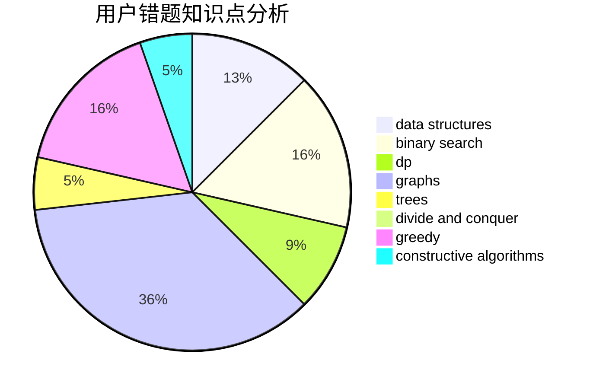

# di_z

<!-- tabs:start -->

#### **用户提交结果分析**

#### **用户做题类型偏好分析**

#### **用户错题知识点分析**

<!-- tabs:end -->
# 推荐题目
[1511E](https://codeforces.com/contest/1511/problem/E)		combinatorics,
                        dp,
                        greedy,
                        math		  
[1059B](https://codeforces.com/contest/1059/problem/B)		implementation		  
[1427B](https://codeforces.com/contest/1427/problem/B)		greedy,
                        implementation,
                        sortings		  
[700E](https://codeforces.com/contest/700/problem/E)		string suffix structures,
                        strings		  
[243D](https://codeforces.com/contest/243/problem/D)		data structures,
                        dp,
                        geometry,
                        two pointers		  
[101D](https://codeforces.com/contest/101/problem/D)		dp,
                        greedy,
                        probabilities,
                        sortings,
                        trees		  
[798E](https://codeforces.com/contest/798/problem/E)		constructive algorithms,
                        data structures,
                        graphs,
                        sortings		  
[1090F](https://codeforces.com/contest/1090/problem/F)		constructive algorithms,
                        interactive		  
[430B](https://codeforces.com/contest/430/problem/B)		brute force,
                        two pointers		  
[75D](https://codeforces.com/contest/75/problem/D)		data structures,
                        dp,
                        greedy,
                        implementation,
                        math,
                        trees		  
