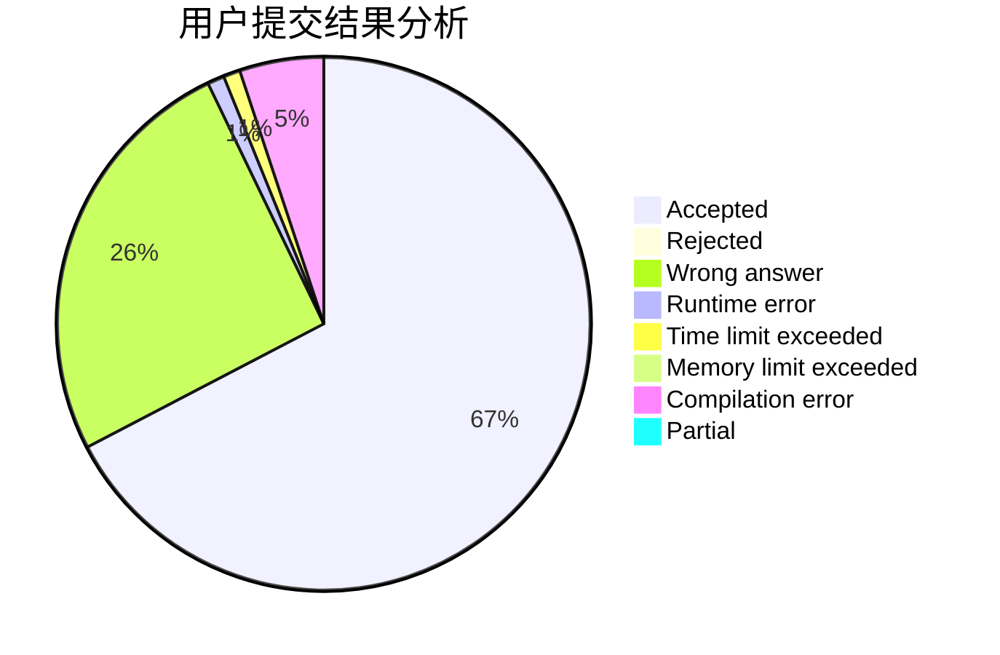
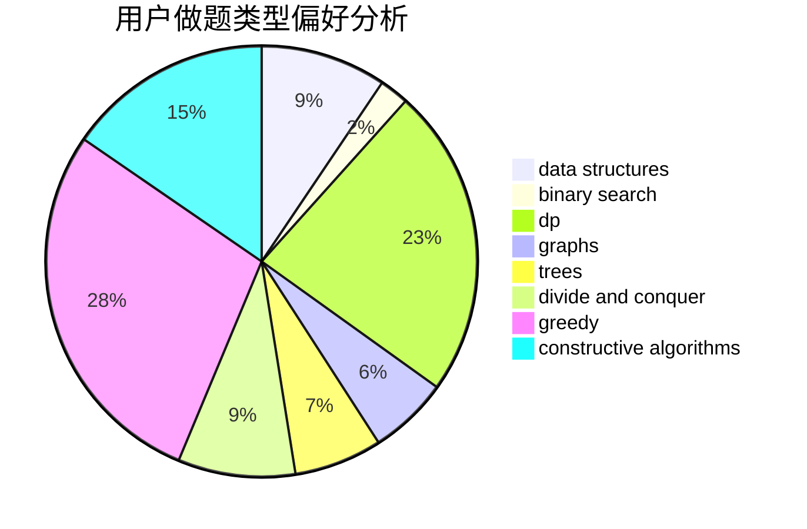
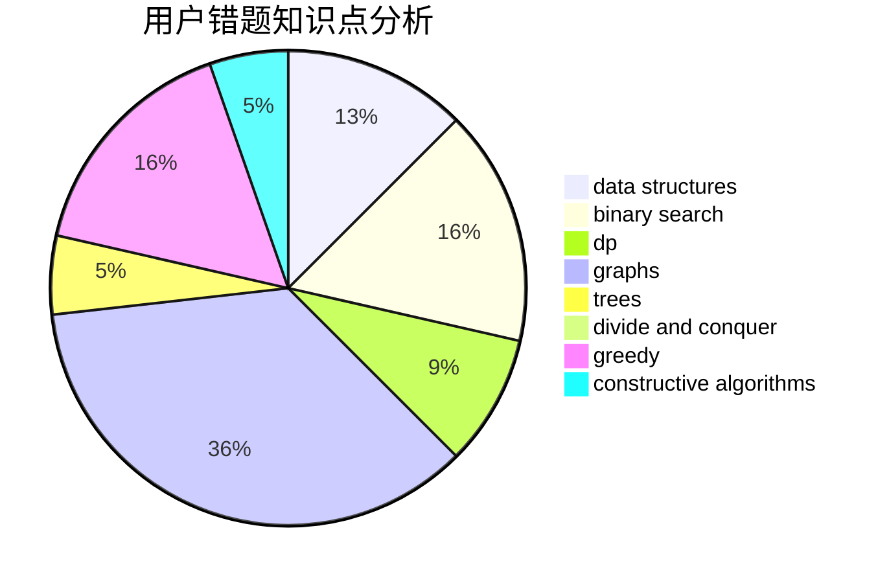

# di_z

<!-- tabs:start -->

#### **用户提交结果分析**

#### **用户做题类型偏好分析**

#### **用户错题知识点分析**

<!-- tabs:end -->
# 推荐题目
[1501D](https://codeforces.com/contest/1501/problem/D)		dsu,graphs,sortings,trees		  
[1058D](https://codeforces.com/contest/1058/problem/D)		dsu,graphs,sortings,trees		  
[1419D1](https://codeforces.com/contest/1419D/problem/1)		binary search,
                        constructive algorithms,
                        greedy,
                        sortings		  
[676E](https://codeforces.com/contest/676/problem/E)		math		  
[225D](https://codeforces.com/contest/225/problem/D)		bitmasks,
                        dfs and similar,
                        graphs,
                        implementation		  
[1019D](https://codeforces.com/contest/1019/problem/D)		binary search,
                        geometry,
                        sortings		  
[780B](https://codeforces.com/contest/780/problem/B)		binary search		  
[1090A](https://codeforces.com/contest/1090/problem/A)		greedy		  
[402B](https://codeforces.com/contest/402/problem/B)		brute force,
                        implementation		  
[739D](https://codeforces.com/contest/739/problem/D)		graph matchings		  
