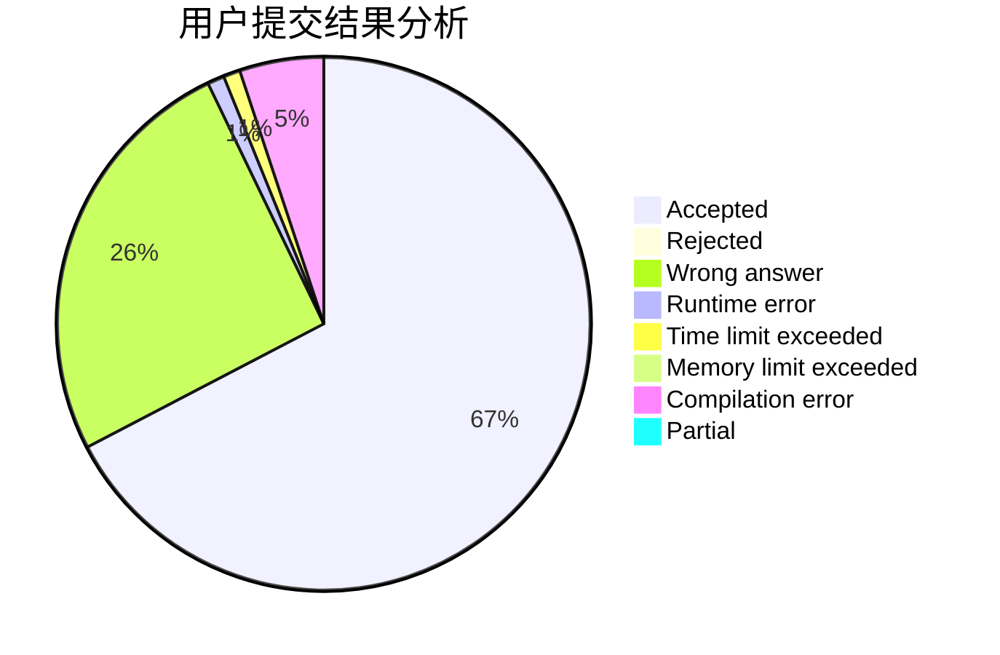
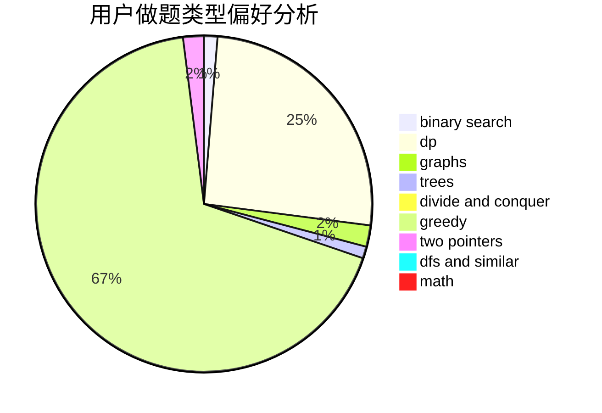

# di_z

<!-- tabs:start -->

#### **用户提交结果分析**

#### **用户做题类型偏好分析**

<!-- tabs:end -->
# 推荐题目
[1511E](https://codeforces.com/contest/1511/problem/E)
[1059B](https://codeforces.com/contest/1059/problem/B)
[1427B](https://codeforces.com/contest/1427/problem/B)
[700E](https://codeforces.com/contest/700/problem/E)
[243D](https://codeforces.com/contest/243/problem/D)
[101D](https://codeforces.com/contest/101/problem/D)
[798E](https://codeforces.com/contest/798/problem/E)
[1090F](https://codeforces.com/contest/1090/problem/F)
[430B](https://codeforces.com/contest/430/problem/B)
[75D](https://codeforces.com/contest/75/problem/D)
