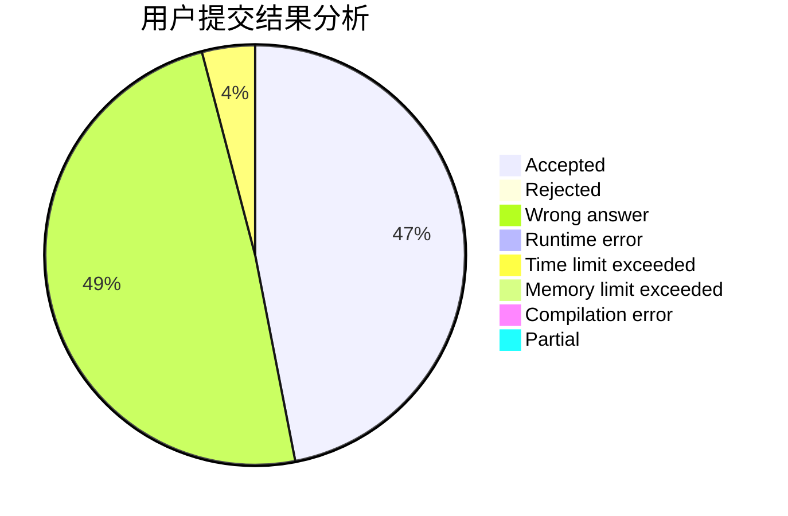
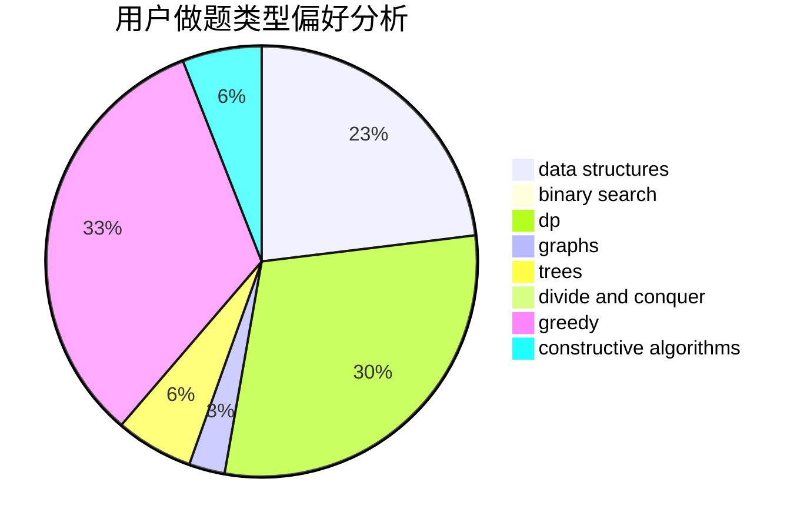
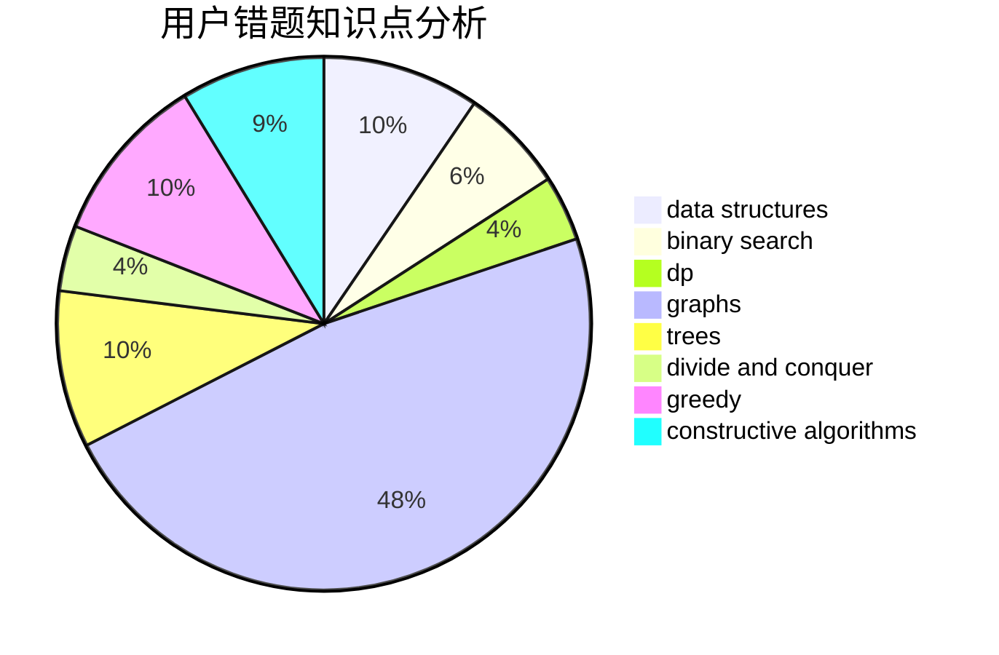

# diamond_dick

<!-- tabs:start -->

#### **用户提交结果分析**

#### **用户做题类型偏好分析**

#### **用户错题知识点分析**

<!-- tabs:end -->
# 推荐题目
[911A](https://codeforces.com/contest/911/problem/A)		implementation		  
[875F](https://codeforces.com/contest/875/problem/F)		dsu,
                        graphs,
                        greedy		  
[1358F](https://codeforces.com/contest/1358/problem/F)		binary search,
                        constructive algorithms,
                        greedy,
                        implementation		  
[279A](https://codeforces.com/contest/279/problem/A)		brute force,
                        geometry,
                        implementation		  
[291A](https://codeforces.com/contest/291/problem/A)		*special problem,
                        implementation,
                        sortings		  
[960C](https://codeforces.com/contest/960/problem/C)		bitmasks,
                        constructive algorithms,
                        greedy,
                        implementation		  
[898C](https://codeforces.com/contest/898/problem/C)		implementation,
                        strings		  
[522D](https://codeforces.com/contest/522/problem/D)		*special problem,
                        data structures		  
[1210E](https://codeforces.com/contest/1210/problem/E)		math		  
[44C](https://codeforces.com/contest/44/problem/C)		implementation		  
